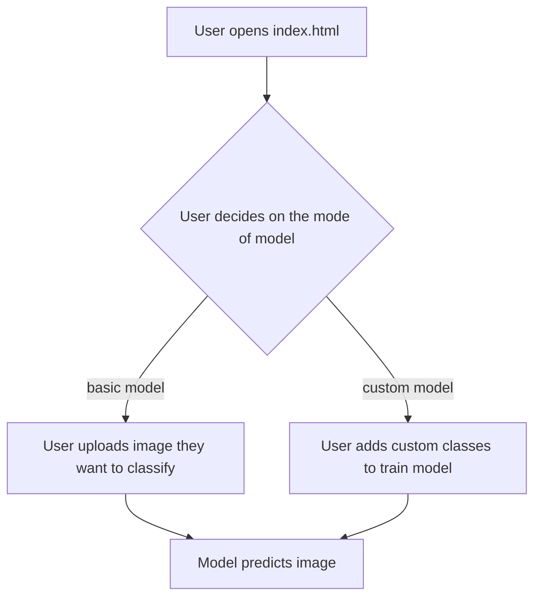

# Project Architecture

## Overview

Image classifier is a web based classification tool which helps user to classify their images. User can make use of the trained model or create their own via custom mode.

---

## Purpose & Goals

- Allows users to classify their images into varied classes
- Makes use of MobileNet and KNN to provide accurate predictions
- Allow users to create their own image classification model via their images

- Goal 1 : User friendly image classification model
- Goal 2 : Custom image classification model
- Goal 3 : Help users understand how image classification models work

---

## Folder Structure

```text
image-classifier/
├── index.html          # Entry point and UI shell
├── script.js           # Core logic and event handling
├── style.css           # All visual styling
└── Architecture.md     # Description of whole project
```

---

## System / Project Architecture Overview

The project follows a simple separation of concerns: 
index.html defines the structure, style.css handles all presentation, and script.js owns all behaviour.
There is no build step — the browser loads files directly. The project can be run seperately by running the index.html file of this project


---

## Component Breakdown

| File | Responsibility |
|---|---|
| `index.html` | UI of the project and loads scripts |
| `script.js` | Handles logic of the project and loading of the model |
| `style.css` | Layout, colours, animations, responsive design |

---

## Data Flow / Execution Flow



---

## Key Features

- User friendly image classification model
- Customised model creation
- Accurate predictions

---

## Technologies Used

| Technology | Purpose |
|---|---|
| HTML5 | Page structure and semantic markup |
| CSS3 | Layout and responsive design |
| JavaScript | Model logic and prediction |
| MobileNet | Image classification model |
| KNN | Algorithm to identify classes |

---

## File Responsibilities

### `index.html`

- User interface for image classification
- Displays prediction

### `script.js`

- Load image classification model
- Logic to upload image
- Create custom image classes
- Logic for prediction of image class

### `style.css`

- Adding style to the webpage

---

## Design Decisions

- **Pure logic engine separation** — `classifierEngine.js` holds DOM-free, testable utilities (prediction formatting, class-name validation, confidence formatting) and exposes them through a UMD-style export for use in both the browser and Node tests.
- **Transfer learning with KNN** — custom mode reuses MobileNet's feature extraction (`model.infer`) and feeds the activations into a KNN classifier, letting users train a custom model with only a handful of images per class.
- **Client-side only** — all inference runs in the browser; images are never uploaded to a server.
- **Low confidence guard** — predictions below a 10% probability are flagged as low-confidence instead of being shown as reliable results.

---

## Dependencies

| Dependency | Version | How loaded | Purpose |
|---|---|---|---|
| Outfit (font) | - | Google Fonts CDN | UI typography |

---

## Future Improvements

- Visualisation of the working of the model while training
- Increased accuracy

---

## Known Limitations

- The model has difficulties in analysing accurately the species of animals (e.g. predicting a bulldog as a boxer)
- During custom modelling test image is not displayed on the webpage

---

## Development Notes

- Open index.html through a local server (e.g. `python3 -m http.server 8000`), not by double-clicking the file. The file:// protocol blocks Web Workers and some fetch calls.
- Visit (`http://localhost:8000`)

---

## License & Attribution

- **Project License:** MIT
- **Third-Party Assets:**
  - Poppins (font) — Google Fonts CDN — UI typography
  - TensorFlow.js — CDN via jsDelivr — in-browser ML runtime
  - MobileNet (`@tensorflow-models/mobilenet`) — CDN via jsDelivr — feature extraction model
  - KNN Classifier (`@tensorflow-models/knn-classifier`) — CDN via jsDelivr — custom class prediction

---

## References

- [TensorFlow.js](https://www.tensorflow.org/js) — ML runtime used for in-browser inference
- [MobileNet — TensorFlow Models](https://github.com/tensorflow/tfjs-models) — feature extraction backbone
- [MDN Web Docs — File API](https://developer.mozilla.org/en-US/docs/Web/API/File) — local image upload handling