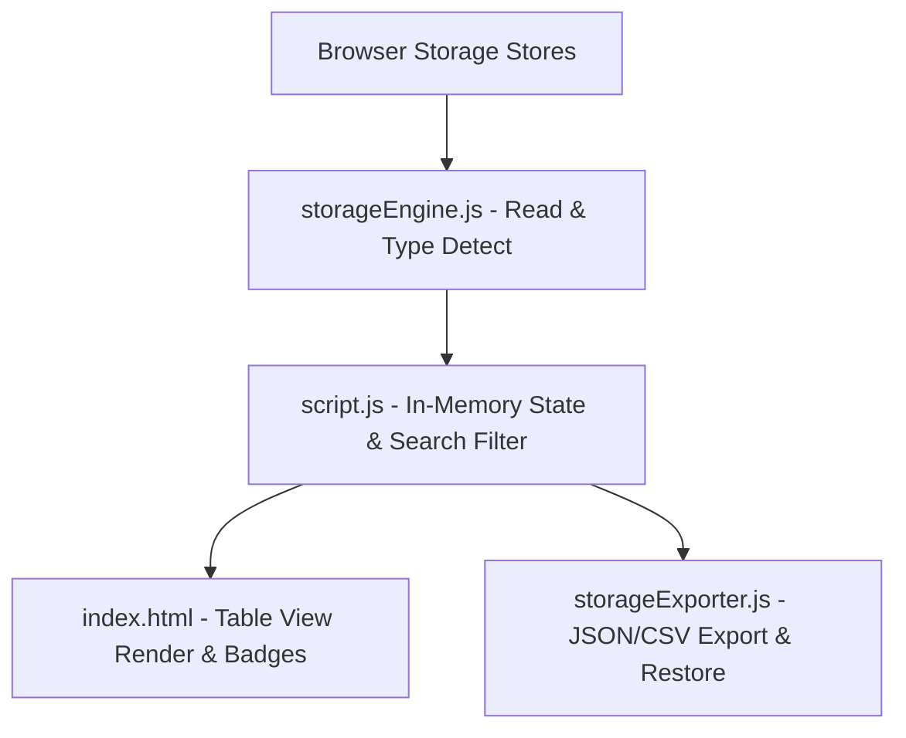

# Browser Storage Inspector Architecture

## Overview

Browser Storage Inspector & Backup Manager is a client-side dev tool that inspects, searches, filters, edits, and backs up data across LocalStorage, SessionStorage, Cookies, and IndexedDB stores.

---

## Purpose & Goals

- Provide a single dashboard for inspecting LocalStorage, SessionStorage, Cookies, and IndexedDB
- Detect each stored value's data type and byte footprint at a glance
- Support editing, deleting, and clearing entries across all four stores
- Offer JSON/CSV backup export so storage can be audited or restored
- Stay fully client-side and dependency-free using native browser storage APIs

---

## Folder Structure

```text
projects/dev-tools/browser-storage-inspector/
├── ARCHITECTURE.md    # System architecture and maintenance documentation
├── index.html         # HTML layout, summary cards, search toolbar, storage forms
├── storageEngine.js   # Storage data type detection, byte footprint calculation, store reader
├── storageExporter.js # JSON and CSV export serializers and snapshot validation
├── script.js          # Controller script, DOM event handlers, tab navigation
└── style.css          # Responsive dashboard styling, badge tags, form controls
```

---

## System / Project Architecture Overview



---

## Component Breakdown

| File | Role |
| --- | --- |
| `storageEngine.js` | Data type detection (JSON, JWT, Base64, String, Number), byte size estimation, store reading. |
| `storageExporter.js` | JSON snapshot creation, CSV serialization, backup restoration validation. |
| `script.js` | Main app controller, event routing, form submissions, DOM table rendering. |
| `index.html` | Dashboard layout, search & filter toolbar, storage tab sections, input forms. |
| `style.css` | Glassmorphic cards, data type badge colors, responsive table wrappers. |

---

## Data Flow / Execution Flow

```text
User opens index.html
        ↓
Browser loads tokens.css → storageEngine.js → storageExporter.js → script.js
        ↓
initializeInspector() attaches tab, form, and toolbar listeners
        ↓
refreshAll() reads stores via storageEngine (readWebStorage / readCookies)
        ↓
renderAll() filters by search query and data-type filter
        ↓
renderRows() builds table rows with type badges and byte sizes
        ↓
User submits a form / clicks Delete / Clear / Export
        ↓
script.js writes to the store or calls the exporter
        ↓
refreshAll() re-reads and re-renders the dashboard
```

---

## Key Features

- Reads and displays LocalStorage, SessionStorage, Cookie, and IndexedDB entries
- Data type detection: JSON, JWT, Base64, Boolean, Number, String
- Byte-size estimation per key/value pair with B/KB/MB formatting
- Live search across keys and values plus a data-type filter dropdown
- Add, edit, and delete entries via per-store forms and action buttons
- Clear-all buttons per store and a "Seed Demo Data" helper
- JSON and CSV export with a versioned snapshot payload

---

## Technologies Used

| Technology | Purpose |
|---|---|
| HTML5 | Page structure and semantic markup |
| CSS3 (Grid, Flexbox, Custom Properties) | Dashboard layout, badges, responsive design |
| Vanilla JavaScript (ES6+) | Store reading, rendering, event handling |
| Web Storage API | Reading/writing localStorage and sessionStorage |
| `document.cookie` API | Reading, writing, and clearing cookies |
| IndexedDB API | Listing databases and object stores |
| Blob + `URL.createObjectURL` | Client-side JSON/CSV downloads |
| Space Grotesk (Google Fonts) | UI typography |

---

## File Responsibilities

### `storageEngine.js`

- `detectDataType(value)` — classifies a raw string as json, jwt, base64, boolean, number, or string
- `calculateByteSize(key, value)` — estimates UTF-16 byte footprint of a key/value pair
- `formatBytes(bytes)` — renders the size as B, KB, or MB
- `filterItems(items, query, typeFilter)` — search and data-type filtering
- `readWebStorage(storeType)` — reads all entries from localStorage or sessionStorage
- `readCookies()` — parses `document.cookie` into structured items

### `storageExporter.js`

- `exportToJSON(items, storeType)` — builds a versioned JSON snapshot with metadata
- `exportToCSV(items)` — serializes rows to CSV with double-quote escaping
- `validateImportJSON(jsonString)` — checks a snapshot's shape before restore
- `restoreStorage(dataMap, targetStore, overwrite)` — writes a snapshot back into a store

### `script.js`

- `initializeInspector()` — binds tabs, forms, clear buttons, and toolbar actions
- `refreshAll()` — reads all stores and re-renders
- `renderAll()` / `renderRows()` — applies filters and builds table rows
- `handleFormSubmit()` — saves new entries to the target store
- `deleteItem()` / `clearStorage()` — removes single entries or whole stores
- `seedDemoData()` — populates demo records across stores
- `exportJSON()` / `exportCSV()` / `downloadFile()` — export and download helpers

### `index.html`

- Summary card grid with live per-store counts
- Search box and data-type filter toolbar
- Tab navigation for the four storage panels
- Per-store editor forms and clear/action buttons
- Table wrappers for each store's rows

### `style.css`

- Glassmorphic panels, summary cards, and tab styling
- Per-type badge colors (`badge-json`, `badge-jwt`, `badge-base64`, etc.)
- Responsive breakpoints at 900px and 560px

---

## Design Decisions

- **Engine/exporter split** — pure logic lives in `storageEngine.js` and `storageExporter.js`, wrapped in UMD-style IIFEs so the same functions work as browser globals (`window.StorageEngine` / `window.StorageExporter`) and as `require()`-able modules for unit tests.
- **Heuristic type detection** — values are classified by shape (a JSON parse attempt, JWT dot-segments, Base64 charset/length) rather than by any storage-side schema, since web storage carries no type information.
- **In-memory state in `script.js`** — `storageState` holds the last snapshot read from the stores so search and filtering re-render without touching storage on every keystroke.
- **No framework** — vanilla JS and native browser APIs keep the tool dependency-free and easy for a first-time contributor to read.

---

## Dependencies

None beyond native browser APIs. The only external resource is the "Space Grotesk" webfont loaded from Google Fonts — no runtime libraries are required.

---

## Future Improvements

- Add JSON snapshot import/restore to the UI (the exporter already implements `validateImportJSON` and `restoreStorage`)
- Extend IndexedDB support beyond Chromium-based browsers
- Add copy-to-clipboard for individual values
- Show a per-store total byte count in the summary grid

---

## Known Limitations

- HttpOnly cookies cannot be read or displayed due to browser security rules
- IndexedDB listing works only in Chromium-based browsers and some recent browsers
- Byte sizes estimate UTF-16 code units rather than exact UTF-8 storage bytes
- Editing is limited to string values; binary Blobs in IndexedDB are not editable

---

## Development Notes

- Open `index.html` through a local server for the most consistent storage behavior
- `storageEngine.js` and `storageExporter.js` can be unit-tested with Node.js via their UMD exports
- No build step is required — edit the files and refresh the browser

---

## License & Attribution

- **Project License:** MIT
- **Third-Party Assets:**
  - "Space Grotesk" font by [Google Fonts](https://fonts.google.com/specimen/Space+Grotesk) (OFL License)

---

## References

- [MDN Web Docs — Web Storage API](https://developer.mozilla.org/en-US/docs/Web/API/Web_Storage_API)
- [MDN Web Docs — IndexedDB API](https://developer.mozilla.org/en-US/docs/Web/API/IndexedDB_API)
- [MDN Web Docs — Document: cookie property](https://developer.mozilla.org/en-US/docs/Web/API/Document/cookie)
