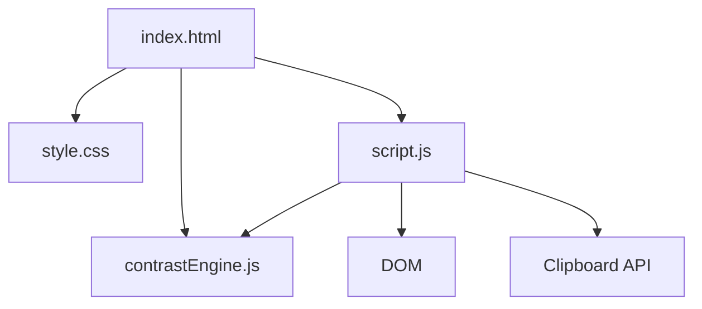

# Color Contrast Checker Architecture

## Overview

Color Contrast Checker is a client-side accessibility utility for comparing foreground and background color pairs. It calculates WCAG contrast ratios in the browser, reports AA and AAA pass/fail states, and helps users copy accessible CSS variables without a backend or build step.

---

## Purpose & Goals

- Provide a quick browser tool for validating color contrast against WCAG thresholds.
- Keep the WCAG math in pure JavaScript functions that can be tested with Node.js.
- Offer practical next steps through accessible color suggestions and CSS variable output.
- Match the repository's lightweight mini-project pattern with plain HTML, CSS, and JavaScript.

---

## Folder Structure

```text
color-contrast-checker/
├── index.html          # Semantic UI shell and form controls
├── style.css           # Responsive dark-theme styling
├── script.js           # DOM events, rendering, clipboard, and palette interactions
├── contrastEngine.js   # Pure WCAG contrast logic and exports for tests
├── ARCHITECTURE.md     # Project architecture documentation
└── thumbnail.svg       # Generated project thumbnail
```

---

## System / Project Architecture Overview

The project separates testable contrast logic from browser-only UI code. `index.html` loads `contrastEngine.js` first, exposing pure functions through the `ContrastEngine` object, then loads `script.js`, which reads user inputs, calls the engine, and renders the results.



---

## Component Breakdown

| File | Responsibility |
|---|---|
| `index.html` | Provides color inputs, preview area, status cards container, suggestions area, palette list, and script loading order. |
| `style.css` | Defines the dark dev-tools layout, responsive grid, controls, status cards, suggestions, and palette buttons. |
| `script.js` | Connects DOM events to the engine, syncs color picker and text input values, renders WCAG results, applies palettes, and copies CSS variables. |
| `contrastEngine.js` | Normalizes hex colors, converts hex to RGB, calculates relative luminance and contrast ratio, evaluates WCAG thresholds, and suggests accessible alternatives. |

---

## Data Flow / Execution Flow

```text
User opens index.html
↓
Browser loads style.css, contrastEngine.js, then script.js
↓
script.js renders local sample palettes and reads the default colors
↓
ContrastEngine validates hex values and calculates the contrast report
↓
script.js updates the ratio, preview, status cards, and suggestions
↓
User changes colors, applies a palette, picks a suggestion, or copies CSS
↓
The relevant event handler reruns the report and updates the DOM
```

---

## Key Features

- Foreground and background color inputs with synchronized color pickers.
- Hex validation for `#rgb`, `rgb`, `#rrggbb`, and `rrggbb` formats.
- WCAG contrast ratio calculation using relative luminance.
- AA and AAA pass/fail cards for normal text, large text, and UI components.
- Suggested lighter or darker foreground alternatives when the current pair fails AA normal text.
- Copy-to-clipboard CSS variables for the active foreground/background pair.
- Local sample palettes for quick accessibility checks.

---

## Technologies Used

| Technology | Purpose |
|---|---|
| HTML5 | Semantic structure for the tool UI. |
| CSS3 | Grid, responsive layout, custom properties, and dark dev-tools styling. |
| Vanilla JavaScript | WCAG calculations, DOM updates, palette interactions, and clipboard support. |
| Clipboard API | Copies generated CSS variables from the browser. |
| Node.js `node:test` | Unit tests for contrast math, hex validation, and pass/fail logic. |

---

## File Responsibilities

### `index.html`

- Defines the foreground and background input controls.
- Provides the live sample preview and ratio display.
- Contains empty result containers that `script.js` fills on load.
- Loads `contrastEngine.js` before `script.js` so UI code can call the engine.

### `contrastEngine.js`

- `normalizeHex(input)` accepts supported hex formats and returns normalized lowercase `#rrggbb` values.
- `isValidHexColor(input)` returns whether a value can be normalized.
- `hexToRgb(input)` converts normalized colors into RGB channel values.
- `getRelativeLuminance(input)` implements WCAG relative luminance.
- `calculateContrastRatio(foreground, background)` returns a rounded contrast ratio.
- `getWcagStatus(ratio)` maps the ratio to AA/AAA pass/fail booleans.
- `suggestAccessibleAlternatives(foreground, background)` finds lighter and darker foreground candidates.
- `getCssVariables(foreground, background)` creates a reusable CSS variable block.
- `getContrastReport(foreground, background)` returns the full validation, ratio, status, suggestions, and CSS payload.

### `script.js`

- Syncs text fields and color picker values.
- Renders status cards from `getWcagStatus`.
- Updates the preview panel and ratio meter.
- Applies local sample palettes.
- Applies suggested foreground colors.
- Copies CSS variables with the Clipboard API.

### `style.css`

- Defines the page shell, input controls, status grid, suggestions, and palette list.
- Uses responsive breakpoints so the two-column workspace stacks cleanly on smaller screens.
- Uses pass/fail color treatments that remain readable on the dark background.

---

## Design Decisions

- **Pure engine module** — WCAG calculations live in `contrastEngine.js` without DOM references, which keeps the important accessibility logic easy to test.
- **Script tag compatible export** — the engine attaches to `ContrastEngine` in the browser and exports through `module.exports` in Node.js, avoiding a bundler.
- **Foreground-first suggestions** — suggested alternatives modify the foreground color because that is usually the safest token to adjust while preserving a chosen background surface.
- **Local palettes only** — sample palettes are embedded in the engine to avoid network requests and keep the tool fully offline.
- **No framework** — the project follows the repository's mini-project convention of plain browser files.

---

## Dependencies

None. The project uses native browser APIs and Node.js built-ins only.

---

## Future Improvements

- Add APCA contrast alongside WCAG 2.x ratios for comparison.
- Let users lock either foreground or background before generating suggestions.
- Export all sample palettes as CSS custom properties.
- Add a small history of recently tested color pairs.

---

## Known Limitations

- Suggestions adjust only the foreground color.
- The checker evaluates solid hex colors and does not account for gradients, opacity, images, or blend modes.
- Thresholds follow WCAG 2.x contrast ratios and do not include APCA scoring.

---

## Development Notes

- Open the project through a local server from the repository root for the closest browser behavior:
  ```bash
  python3 -m http.server 8000
  ```
- Run the focused unit tests with:
  ```bash
  node --test tests/color-contrast-checker.test.js
  ```
- Regenerate the project registry and thumbnail with:
  ```bash
  npm run build
  ```

---

## License & Attribution

- **Project License:** MIT, following the repository license.
- **Third-Party Assets:** None. The UI, logic, documentation, and generated thumbnail are repository-native.

---

## References

- [Web Content Accessibility Guidelines 2.2](https://www.w3.org/TR/WCAG22/)
- [WCAG Understanding Success Criterion 1.4.3 Contrast Minimum](https://www.w3.org/WAI/WCAG22/Understanding/contrast-minimum.html)
- [WCAG Understanding Success Criterion 1.4.11 Non-text Contrast](https://www.w3.org/WAI/WCAG22/Understanding/non-text-contrast.html)
- [MDN Web Docs: Relative luminance](https://developer.mozilla.org/en-US/docs/Web/Accessibility/Guides/Colors_and_Luminance)
