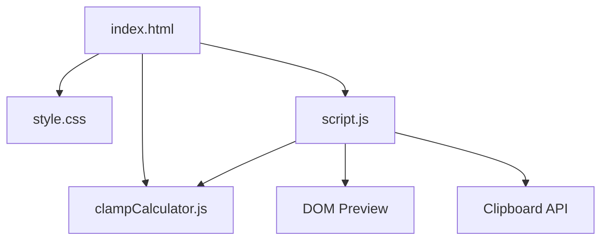

# CSS Clamp Calculator Architecture

## Overview

CSS Clamp Calculator is a client-side dev tool for generating responsive CSS `clamp()` formulas. It accepts viewport and value ranges, calculates the preferred `calc()` expression, previews the result, and provides copy-ready CSS without a build step or backend.

---

## Purpose & Goals

- Help developers generate accurate responsive `clamp()` formulas.
- Keep clamp math and unit conversion in a pure JavaScript module for unit testing.
- Provide practical presets for common CSS properties like type, spacing, gap, and container width.
- Follow Cradle's lightweight mini-project structure with plain HTML, CSS, and JavaScript.

---

## Folder Structure

```text
css-clamp-calculator/
├── index.html          # Entry point, controls, generated output, and preview
├── style.css           # Responsive dev-tools layout and preview styling
├── script.js           # DOM events, presets, clipboard, and preview updates
├── clampCalculator.js  # Pure clamp formula, validation, and unit conversion logic
├── ARCHITECTURE.md     # Project architecture documentation
└── thumbnail.svg       # Generated gallery thumbnail
```

---

## System / Project Architecture Overview

The project separates formula generation from UI orchestration. `clampCalculator.js` exposes pure functions for validating input, calculating slope/intercept values, generating CSS output, and converting between `px` and `rem`. `script.js` reads form values, calls the engine, updates the output panels, and applies the generated rule to the preview box.



---

## Component Breakdown

| File | Responsibility |
|---|---|
| `index.html` | Provides form inputs, preset selector, output cards, preview area, and shared BackToHome loading. |
| `style.css` | Defines the dark dev-tools layout, form controls, output panels, responsive behavior, and live preview. |
| `script.js` | Connects input events to the engine, applies presets, copies generated CSS, converts units, and updates preview styles. |
| `clampCalculator.js` | Validates numeric ranges, calculates preferred values, generates `clamp()` CSS, and handles px/rem conversion. |

---

## Data Flow / Execution Flow

```text
User opens index.html
↓
Browser loads style.css, BackToHome, clampCalculator.js, then script.js
↓
script.js renders presets and applies the default font-size preset
↓
ClampCalculator validates inputs and calculates slope/intercept values
↓
script.js renders the clamp formula, CSS rule, explanation, and preview
↓
User edits values, changes presets, copies CSS, or converts units
↓
The matching event handler reruns the engine and updates the DOM
```

---

## Key Features

- Minimum and maximum viewport inputs.
- Minimum and maximum CSS value inputs.
- Unit selector for `rem` and `px`.
- Copy-ready `clamp()` formula and CSS rule output.
- Live preview box that applies the selected CSS property.
- Presets for font size, padding, gap, and container width.
- Preferred value explanation based on calculated slope and intercept.
- px/rem conversion helper for min and max values.

---

## Technologies Used

| Technology | Purpose |
|---|---|
| HTML5 | Semantic page structure and form controls. |
| CSS3 | Responsive layout, custom properties, preview styling, and `clamp()` usage. |
| Vanilla JavaScript | Formula generation, DOM updates, presets, clipboard, and unit conversion. |
| Clipboard API | Copies generated CSS rules. |
| Node.js `node:test` | Unit tests for formula generation, conversion, and invalid input handling. |

---

## File Responsibilities

### `index.html`

- Defines all numeric inputs and the CSS property field.
- Provides the preset selector and action buttons.
- Contains generated formula, CSS rule, and explanation output cards.
- Provides the live preview panel.
- Loads the shared `BackToHome` component used by Cradle mini projects.

### `clampCalculator.js`

- `validateInput(input)` normalizes and validates viewport/value ranges.
- `calculatePreferredValue(input)` calculates slope and intercept values.
- `generateClamp(input)` builds the `clamp()` formula, CSS rule, and explanation.
- `pxToRem(px, baseFontSize)` converts pixels to rem units.
- `remToPx(rem, baseFontSize)` converts rem units to pixels.
- `convertValue(value, fromUnit, toUnit, baseFontSize)` supports UI unit switching.
- `PRESETS` stores local default configurations for common use cases.

### `script.js`

- Reads form values and calls `ClampCalculator.generateClamp`.
- Renders presets into the selector.
- Applies generated CSS to the preview box.
- Copies the generated CSS rule to the clipboard.
- Converts min/max values between `px` and `rem`.
- Displays validation errors without crashing the page.

### `style.css`

- Defines the dev-tools color palette and responsive shell.
- Styles form controls, output panels, messages, and action buttons.
- Creates a live preview area that can safely receive generated CSS properties.
- Uses responsive breakpoints so the layout stacks on smaller screens.

---

## Design Decisions

- **Pure calculator module** — formula generation and validation live outside the DOM so the most important behavior can be unit-tested.
- **Slope/intercept output** — the preferred value is explained in terms of viewport slope and intercept so contributors can verify the math.
- **Preset-first workflow** — presets give users a useful starting point before they customize exact ranges.
- **Limited unit scope** — `px` and `rem` cover the common responsive design use cases while keeping validation predictable.
- **Shared BackToHome component** — the page loads the repository navigation component for consistency with other Cradle mini projects.

---

## Dependencies

None. This project uses only native browser APIs and Node.js built-ins for tests.

---

## Future Improvements

- Add support for `em`, `%`, `vw`, and custom root font sizes in the UI.
- Add a small graph showing value growth across the viewport range.
- Allow exporting multiple generated design tokens at once.
- Add named token storage in localStorage.

---

## Known Limitations

- Unit conversion uses a fixed 16px base font size in the UI.
- The preview applies one property at a time and does not simulate every layout context.
- The calculator expects the maximum viewport to be greater than the minimum viewport.

---

## Development Notes

- Run the project through a local server from the repository root:
  ```bash
  python3 -m http.server 8000
  ```
- Run focused tests with:
  ```bash
  node --test tests/css-clamp-calculator.test.js
  ```
- Regenerate the project registry and thumbnail with:
  ```bash
  npm run build
  ```

---

## License & Attribution

- **Project License:** MIT, following the repository license.
- **Third-Party Assets:** None. The UI, logic, tests, and generated thumbnail are repository-native.

---

## References

- [MDN Web Docs: clamp()](https://developer.mozilla.org/en-US/docs/Web/CSS/clamp)
- [MDN Web Docs: calc()](https://developer.mozilla.org/en-US/docs/Web/CSS/calc)
- [CSS Values and Units Module Level 4](https://www.w3.org/TR/css-values-4/)
