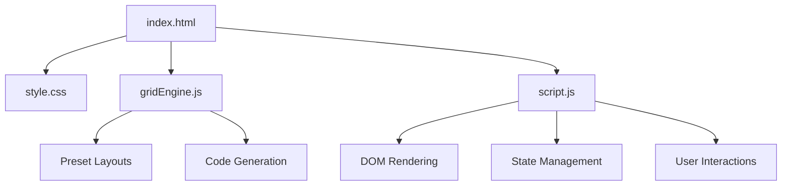

# CSS Grid Generator

> A visual tool for designing CSS Grid layouts with live preview and code export.

---

## Overview

CSS Grid Generator lets users design CSS Grid layouts visually in the browser. Users configure columns, rows, gap sizes, and item placements, then see a live preview and export production-ready HTML/CSS code. It includes several built-in layout presets (Holy Grail, Sidebar, Dashboard, etc.) and supports named grid areas for semantic layouts.

---

## Purpose & Goals

- Provide an intuitive visual interface for designing CSS Grid layouts
- Generate clean, production-ready HTML and CSS code
- Include common layout presets for quick prototyping
- Support named grid areas for semantic layouts
- Keep the codebase vanilla HTML/CSS/JS with no build step

---

## Folder Structure

```text
css-grid-generator/
├── index.html      # Entry point and UI shell
├── style.css       # All visual styling
├── gridEngine.js   # Pure grid logic, code generation, presets
├── script.js       # UI controller, event handling, rendering
└── ARCHITECTURE.md # This file
```

---

## System / Project Architecture Overview

The project follows a clean separation of concerns:

- `index.html` defines the page structure with two-column layout (controls + preview)
- `gridEngine.js` is a pure logic module (no DOM dependency) that generates CSS/HTML code
- `script.js` manages DOM interactions, state, and live preview rendering
- `style.css` handles all visual presentation with CSS custom properties



---

## Component Breakdown

| File | Responsibility |
|---|---|
| `index.html` | Page shell with two-column layout, all UI controls and preview area |
| `style.css` | Dark/light theme, grid preview styling, responsive layout, code output styling |
| `gridEngine.js` | Pure logic: presets, CSS generation, HTML generation, template area building |
| `script.js` | UI controller: state management, event wiring, live preview rendering, copy actions |

---

## Data Flow / Execution Flow

```text
User opens index.html
↓
Browser loads style.css, gridEngine.js, script.js
↓
DOMContentLoaded fires → script.js initializes
↓
Default state: 3×3 grid, 0 items
↓
User configures grid (columns, rows, gaps, sizing)
↓
Or clicks a preset → loads pre-configured state
↓
render() is called → builds grid preview and code output
↓
User adds items, selects items, configures placement
↓
Live preview updates in real-time
↓
Code tab shows generated CSS/HTML
↓
User clicks Copy → clipboard API copies code
```

---

## Key Features

- Interactive grid configuration (columns, rows, column/row sizing, gaps)
- Visual grid item placement with click-to-select editing
- Named grid areas support with template generation
- 6 built-in layout presets (Holy Grail, Sidebar, Cards, Dashboard, Gallery, Blog)
- Live preview with grid line markers
- Export CSS-only, HTML-only, or combined code
- Copy to clipboard with visual feedback
- Grid line number indicators for debugging
- Responsive two-column layout (collapses on mobile)
- Dark theme (default) with light theme support via system toggle

---

## Technologies Used

| Technology | Purpose |
|---|---|
| HTML5 | Page structure and semantic markup |
| CSS3 (Grid, Flexbox, Custom Properties) | Layout, theming, responsive design |
| Vanilla JavaScript (ES6+) | UI logic, state management, DOM manipulation |
| CradleEscape | Shared HTML escaping utility |
| CradleBackToHome | Shared navigation component |
| Google Fonts (Space Grotesk, Fira Code) | Typography |

---

## File Responsibilities

### `gridEngine.js`

- `GridEngine.PRESETS` — Map of 6 named preset layouts with full configurations
- `GridEngine.ITEM_COLORS` — Palette of 12 colors cycled for new items
- `GridEngine.resolveColumnTemplate(count, sizeStr)` — Converts count + sizing string to CSS grid-template-columns
- `GridEngine.resolveRowTemplate(count, sizeStr)` — Converts count + sizing string to CSS grid-template-rows
- `GridEngine.buildTemplateAreas(cols, rows, items)` — Generates grid-template-areas string from item placements
- `GridEngine.generateCSS(config, items)` — Produces complete CSS code string
- `GridEngine.generateHTML(items, useAreas)` — Produces HTML markup string
- `GridEngine.generateCode(tab, config, items)` — Returns CSS, HTML, or both based on selected tab
- `GridEngine.nextColor(count)` — Returns next palette color based on item count
- `GridEngine.autoAreaName(count)` — Suggests a name for new items

### `script.js`

- `getConfig()` — Reads current UI state into a config object
- `render()` — Full re-render: updates preview grid, line markers, and code output
- `renderLineMarkers(config)` — Draws column/row line number markers in the preview
- `highlightCode()` — Applies syntax highlighting to the code output
- `selectItem(idx)` / `deselectItem()` — Manages item selection and shows config card
- `addItem()` / `removeItem()` / `resetGrid()` — Item and grid lifecycle management
- `loadPreset(name)` — Loads a preset layout configuration
- `copyCode()` — Copies generated code to clipboard

### `style.css`

- CSS custom properties for dark/light theming
- Two-column workspace layout with responsive collapse
- Grid preview container with dashed border and subtle grid background
- Selected item highlight with blue outline and glow
- Code output panel with monospace font and basic syntax colors
- Stepper controls, preset buttons, and config form styling

---

## Design Decisions

- **Engine/UI separation** — `gridEngine.js` contains zero DOM references, making it testable in Node.js
- **No framework** — Vanilla JS keeps the learning curve low and avoids build steps
- **Real-time preview** — Every input change triggers a full re-render for instant feedback
- **Named areas as opt-in** — Users must enable the checkbox; items use `grid-column`/`grid-row` by default for maximum flexibility
- **Cradle conventions** — Uses shared `escapeHtml.js` and `BackToHome.js` components, follows the project's font and token system

---

## Dependencies

| Dependency | Version | How loaded | Purpose |
|---|---|---|---|
| Outfit / Space Grotesk | — | Google Fonts CDN | UI typography |
| Fira Code | — | Google Fonts CDN | Code output monospace font |
| Cradle `escapeHtml.js` | — | Local script tag | HTML escaping for user content |
| Cradle `BackToHome.js` | — | Local script tag (defer) | Shared navigation |

---

## Future Improvements

- Drag-and-drop item resizing in the preview
- Support for auto-fit / auto-fill with minmax
- Named area template editor with visual grid painting
- Responsive breakpoint presets
- CSS Grid inspector that reads existing CSS and reconstructs the visual grid
- Undo/redo history stack
- Export as standalone HTML file download

---

## Known Limitations

- Grid line markers use approximate pixel values for `fr`/`auto` tracks
- No drag-and-drop — items are positioned via numeric input fields
- Named areas require all items to have names before the template is generated
- No mobile touch gestures for item selection
- Code highlighting is regex-based, not a full syntax parser

---

## Development Notes

- Open `index.html` through a local server (e.g. `python3 -m http.server 8000`)
- `gridEngine.js` can be tested in Node.js: `const g = require('./gridEngine.js'); console.log(g.PRESETS);`
- No build step required. Edit files and refresh the browser.
- The project uses CSS custom properties from `src/components/ui/tokens.css` for theme tokens

---

## License & Attribution

- **Project License:** MIT
- **Third-Party Assets:** None — uses only web fonts via Google Fonts CDN

---

## References

- [CSS Grid Layout — MDN](https://developer.mozilla.org/en-US/docs/Web/CSS/CSS_grid_layout)
- [Grid Template Areas — CSS-Tricks](https://css-tricks.com/snippets/css/guide-grid-layout/)
- [CSS Grid Generator by Werkraum](https://grid.layoutit.com/)
