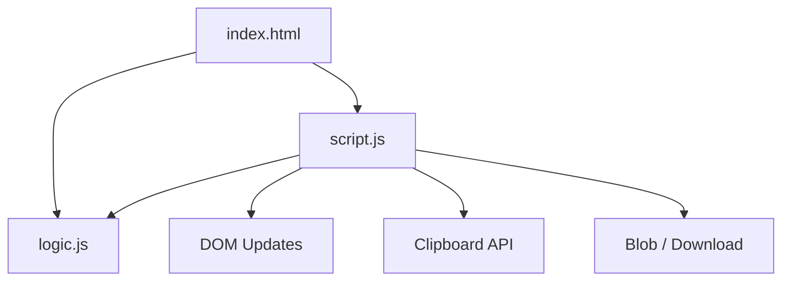

# Project Architecture

## Overview

Encoding Toolkit is a browser-based utility that converts text between six formats — Base64, URL encoding, HTML entities, Unicode escapes, Hex, and Binary. Conversion happens live as the user types, with no submit button, and the result can be copied or exported as a `.txt` file.

---

## Purpose & Goals

- Provide a single all-in-one encoding/decoding tool instead of six separate mini-projects
- Keep all conversion logic pure and DOM-free so it is independently unit-testable
- Handle malformed input gracefully with descriptive errors instead of crashing

---

## Folder Structure

```
encoding-toolkit/
├── ARCHITECTURE.md   # This file
├── index.html         # Page structure: format selector, mode toggle, editors, toolbar
├── logic.js            # Pure encode/decode functions, no DOM dependency
├── script.js           # DOM bindings, event handling, UI state
└── style.css            # Dark-theme styling, responsive layout
```

---

## System / Project Architecture Overview

The project follows the same separation of concerns used elsewhere in this repo: `logic.js` owns pure conversion functions with zero DOM dependency, `script.js` owns all DOM/event wiring and calls into `logic.js`, `style.css` owns presentation, and `index.html` defines structure. There is no build step and no external dependencies — the browser loads the files directly via `<script>` tags.



---

## Component Breakdown

| File | Responsibility |
|---|---|
| `index.html` | Page shell: format `<select>`, encode/decode mode toggle, swap button, input/output textareas, toolbar |
| `logic.js` | Pure encode/decode function pairs for all six formats, no DOM dependency, throws on invalid input |
| `script.js` | Reads DOM state, calls the matching `logic.js` function pair, renders output/errors, handles copy/export/clear |
| `style.css` | Dark theme, responsive two-column editor grid, error/success states |

---

## Data Flow / Execution Flow

```
User opens index.html
        ↓
Browser loads style.css → logic.js → script.js
        ↓
User selects a format and mode (Encode/Decode)
        ↓
User types in the input textarea
        ↓
"input" event fires on every keystroke
        ↓
script.js looks up the matching encode/decode function in CONVERTERS
        ↓
logic.js runs the pure conversion, returns a string or throws an Error
        ↓
script.js writes the result to the output textarea,
   or shows a friendly error message if conversion failed
        ↓
User can Copy, Export as .txt, Swap input/output, or Clear
```

---

## Key Features

- Six formats: Base64, URL, HTML Entities, Unicode Escapes, Hex, Binary
- Live conversion on every keystroke, with debouncing only above 5,000 characters
- Encode/Decode mode toggle per format
- Swap button to flip input and output (and mode) for quick round-tripping
- Copy-to-clipboard with a temporary "Copied!" success state
- Export output as a downloadable `.txt` file
- Character counts for both input and output
- Graceful, descriptive error messages for malformed input in every format (invalid Base64 padding, unbalanced hex digits, non-8-bit binary groups, malformed percent-encoding, unknown HTML entities, malformed Unicode escapes) — the app never throws an uncaught exception to the console

---

## Technologies Used

| Technology | Purpose |
|---|---|
| HTML5 | Page structure and semantic markup |
| CSS3 (Grid, Flexbox, Custom Properties) | Layout, dark theme, responsive design |
| Vanilla JavaScript (ES6+) | Conversion logic and DOM manipulation |
| `TextEncoder` / `TextDecoder` | UTF-8 safe byte-level conversion for Base64, Hex, and Binary |
| Clipboard API | Copy-to-clipboard |
| Blob + `URL.createObjectURL` | Client-side `.txt` export, no server required |

---

## File Responsibilities

### `logic.js`

- `encodeBase64` / `decodeBase64` — UTF-8 safe Base64 via `TextEncoder`/`TextDecoder`, validates charset and padding before decoding
- `encodeURLText` / `decodeURLText` — thin wrapper around `encodeURIComponent`/`decodeURIComponent` that catches malformed `%` sequences
- `encodeHTML` / `decodeHTML` — escapes/unescapes `& < > " '`, plus numeric (`&#65;`, `&#x41;`) and named entity decoding
- `encodeUnicode` / `decodeUnicode` — converts text to/from `\uXXXX` (and `\u{XXXXX}` for code points above `0xFFFF`) escape sequences
- `encodeHex` / `decodeHex` — byte-level hex via `TextEncoder`/`TextDecoder`, validates even-length hex-only input
- `encodeBinary` / `decodeBinary` — byte-level binary via `TextEncoder`/`TextDecoder`, validates 8-bit `0`/`1` groups

### `script.js`

- `CONVERTERS` — lookup table mapping each format's `<select>` value to its `{ encode, decode }` pair
- `convert()` — reads current input/mode/format, runs the conversion, updates output or shows an error
- `handleInput()` — debounces only when input exceeds 5,000 characters
- `swapInputOutput()` — moves output into input and flips the mode
- `copyOutput()` / `exportOutput()` / `clearFields()` — toolbar actions

### `style.css`

- `:root` custom properties for the dark color palette, radii, and shadows (matching the repo-wide idiom)
- `.editor-grid` — two-column responsive layout for input/output
- `.error-message` — inline error banner shown under the output editor

---

## Design Decisions

- **No DOM dependency in `logic.js`** — keeps every conversion function unit-testable with Node's built-in test runner via `require()`, and reusable if the UI is ever reworked.
- **`TextEncoder`/`TextDecoder` instead of raw `btoa`/`atob`** — plain `btoa` breaks on non-Latin1 characters (emoji, CJK, accented text); encoding through UTF-8 bytes first makes Base64/Hex/Binary correct for any Unicode input.
- **Debounce only above 5,000 characters** — the issue asks for live conversion; debouncing by default would make short typing feel laggy. Debouncing only kicks in for pastes large enough that synchronous conversion could stutter the UI.
- **Decode functions throw instead of returning `null`/`undefined`** — forces every call site to handle the error case explicitly rather than silently rendering `"undefined"` in the output box.

---

## Dependencies

None. This project uses only native browser APIs — no external libraries are required.

---

## Future Improvements

- Add example presets per format (a button that fills in a sample string)
- Add a toast notification system shared across the repo instead of inline error text
- Support additional formats (Base32, ROT13, JWT decode)
- Persist the last-used format/mode in `localStorage`

---

## Known Limitations

- Hex/Binary/Base64 decode assumes the decoded bytes represent valid UTF-8 text; binary (non-text) payloads will show a decode error rather than raw bytes
- Unicode encode always emits `\u{...}` for astral code points (emoji, etc.) rather than UTF-16 surrogate pairs — this is intentional and documented, but differs from some other tools

---

## Development Notes

- Open `index.html` through a local server (e.g. `python3 -m http.server 8000`), not by double-clicking the file, for consistent Clipboard API behavior across browsers.
- `logic.js` uses a UMD-style guard so it can be tested with Node.js directly:
  ```
  node -e "const l = require('./logic.js'); console.log(l.encodeBase64('hi'))"
  ```
- No build step is required. Edit the files and refresh the browser.

---

## License & Attribution

- **Project License:** MIT
- **Third-Party Assets:**
  - "Space Grotesk" font by [Google Fonts](https://fonts.google.com/specimen/Space+Grotesk) (OFL License)

---

## References

- [MDN Web Docs — TextEncoder](https://developer.mozilla.org/en-US/docs/Web/API/TextEncoder)
- [MDN Web Docs — TextDecoder](https://developer.mozilla.org/en-US/docs/Web/API/TextDecoder)
- [MDN Web Docs — Clipboard API](https://developer.mozilla.org/en-US/docs/Web/API/Clipboard_API)
- [MDN Web Docs — Blob](https://developer.mozilla.org/en-US/docs/Web/API/Blob)