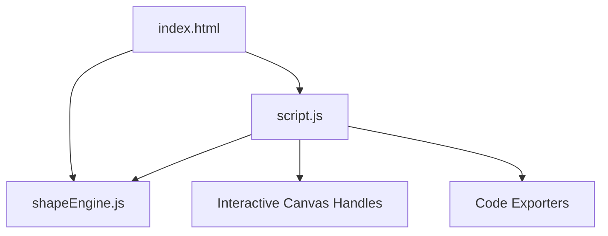

# Project Architecture — CSS Shape Designer

---

## Overview

CSS Shape Designer is an interactive web tool for visually creating custom clip-path polygons, organic border-radius blobs, circles, and ellipses. It provides real-time drag handles, background color/gradient customizers, drop-shadow visualizers, and multi-format code exporters (CSS, SVG, and Tailwind arbitrary values).

---

## Purpose & Goals

- Provide a visual, drag-and-drop generator for CSS `clip-path` shapes and organic `border-radius` blobs.
- Support real-time code export in CSS, SVG, and Tailwind CSS formats.
- Encapsulate shape math into a reusable, UMD-compliant `shapeEngine.js` module.
- Offer shape presets (Triangle, Pentagon, Hexagon, Star, Rhombus, Egg, Bean).

---

## Folder Structure

```
css-shape-designer/
├── index.html          # Shell layout, controls side panel, canvas preview, code modals
├── shapeEngine.js      # Core shape mathematics, clip-path formatting, SVG & Tailwind generators
├── script.js           # DOM event handling, handle dragging, canvas updating
├── style.css           # Custom dark theme, control sliders, handles styling
├── thumbnail.svg       # Card preview asset
└── ARCHITECTURE.md     # Architecture documentation
```

---

## System / Project Architecture Overview



---

## Component Breakdown

| File | Responsibility |
|---|---|
| `index.html` | Controls sidebar, preset buttons, handle container, code tabs |
| `shapeEngine.js` | Pure shape logic, clip-path string generator, SVG exporter, Tailwind generator |
| `script.js` | Mouse/touch drag events, preview element background, handle position synchronization |
| `style.css` | Canvas container styles, drag handle visuals, glassmorphism UI rules |

---

## Data Flow / Execution Flow

```
User selects shape type or clicks preset button
↓
state object is initialized with vertices/radii
↓
script.js renders handles on canvas
↓
User drags handle on canvas or moves control slider
↓
updateCanvas() calls ShapeEngine.generateClipPathCSS()
↓
Preview element clip-path / border-radius & exporters are updated
```

---

## Key Features

- Interactive canvas drag handles for polygon vertices and circle radii.
- Organic 8-point blob border-radius slider generator.
- Multi-fill backgrounds (Solid, Gradient, Image cover).
- Drop-shadow glow intensity slider.
- CSS, SVG, and Tailwind CSS code export.

---

## Technologies Used

| Technology | Purpose |
|---|---|
| HTML5 | Canvas shell, inputs, code export areas |
| CSS3 | UI layout, CSS variables, glassmorphism effects |
| Vanilla JavaScript (ES6+) | Shape Engine, SVG math, DOM drag handlers |

---

## File Responsibilities

### `index.html`
- Contains controls panel, preset containers, drag handle overlay container, and preview box.

### `shapeEngine.js`
- `generateClipPathCSS(type, shapeData)` — Formats CSS clip-path or border-radius rules.
- `generateSVGCode(type, shapeData, width, height)` — Generates standalone vector `<svg>` markup.
- `generateTailwindCode(type, shapeData)` — Produces Tailwind CSS arbitrary utility classes.

### `script.js`
- `updateCanvas()` — Re-evaluates handles, shapes, and exports.
- `handleDocumentMouseMove(e)` — Updates coordinates during handle dragging.

### `style.css`
- Modern dark mode variables, handle styles, SVG tracer overlays.

---

## Design Decisions

- **UMD Module Encapsulation**: Isolated shape calculations in `shapeEngine.js` for standalone Node.js testing without DOM dependencies.
- **SVG Tracer Overlay**: Uses SVG `<polygon>` overlay lines for sharp boundary visualization.

---

## Dependencies

None. Built using native browser APIs and vanilla JavaScript.

---

## Future Improvements

- Add 3D CSS transform matrix visualizer.
- Add animation keyframe generator for shape transitions.

---

## Known Limitations

- Self-intersecting polygon vertices may render inverted fill regions in webkit browser engines.

---

## Development Notes

- Node tests validate `shapeEngine.js` outputs via `node --test tests/css-shape-designer.test.js`.

---

## License & Attribution

- **Project License:** MIT
- **Third-Party Assets:**
  - Google Fonts (Outfit & Fira Code) — Open Font License

---

## References

- [MDN Web Docs — clip-path](https://developer.mozilla.org/en-US/docs/Web/CSS/clip-path)
- [MDN Web Docs — border-radius](https://developer.mozilla.org/en-US/docs/Web/CSS/border-radius)
