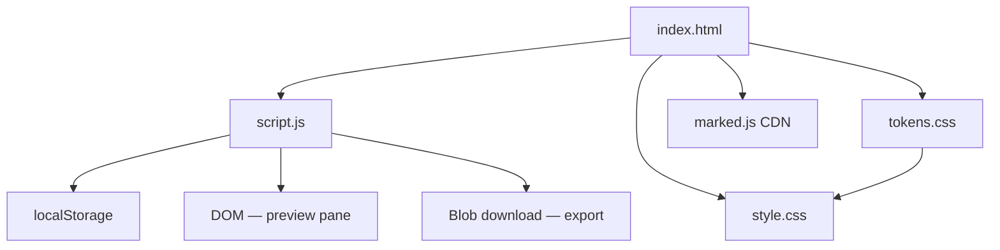

# Markdown Editor — Architecture

> **Project:** Markdown Editor  
> **Category:** Editor  
> **Cradle Path:** `projects/editor/markdown-editor/`

---

## Overview

Markdown Editor is a split-pane writing tool that lets you write Markdown on the left and see a live HTML preview on the right. It includes a formatting toolbar, keyboard shortcuts, word/character count, estimated reading time, resizable panes, export to `.md` and `.html`, and automatic local storage persistence.

---

## Purpose & Goals

- Provide a fast, distraction-free Markdown writing experience
- Render a faithful live HTML preview as the user types
- Offer a toolbar and keyboard shortcuts for common formatting operations
- Allow exporting the document as Markdown or styled HTML
- Persist content across sessions using localStorage
- Remain dependency-free (no build step; Marked.js loaded via CDN)

---

## Folder Structure

```text
markdown-editor/
├── index.html          # Page shell, toolbar, split pane, status bar
├── script.js           # Preview engine, toolbar actions, shortcuts, export, pane resize
├── style.css           # Split layout, toolbar, markdown body styling
└── ARCHITECTURE.md     # This file
```

---

## System / Project Architecture Overview



---

## Component Breakdown

| File | Responsibility |
|------|---------------|
| `index.html` | Page structure, semantic HTML, toolbar buttons, split pane, status bar, loads Cradle tokens and Marked.js |
| `script.js` | Markdown parsing, toolbar action handlers, keyboard shortcuts, export functions, pane resize, word/char count, auto-save |
| `style.css` | Split-pane layout, toolbar, markdown body typography, responsive breakpoints, status bar |

---

## Data Flow / Execution Flow

```text
User opens index.html
↓
Browser loads tokens.css, style.css, marked.js, script.js
↓
init() runs: loads saved content (or default), calls syncAll()
↓
syncAll() parses Markdown → renders HTML in preview pane, updates counts
↓
User types in textarea
↓
input event → syncAll() → renderPreview() → updateCounts()
↓
User clicks toolbar button or presses keyboard shortcut
↓
Action function wraps/inserts text at cursor → syncAll()
↓
Every 2s: localStorage auto-save
↓
User clicks Export → blob created → browser download prompt
```

---

## Key Features

- **Split-pane layout** — side-by-side editor and live preview with draggable divider
- **14 toolbar actions** — heading, bold, italic, strikethrough, lists, checklist, link, image, code, code block, blockquote, table, horizontal rule
- **Keyboard shortcuts** — Ctrl+B, Ctrl+I, Ctrl+D, Ctrl+K, Ctrl+Q, Ctrl+H, Ctrl+`, Ctrl+S (export)
- **Live Markdown parsing** via Marked.js with GFM support and code block rendering
- **Word and character count** — updated in real time
- **Estimated reading time** — based on 200 words/minute
- **Cursor position indicator** — line and column number
- **Export to Markdown** — downloads a `.md` file
- **Export to styled HTML** — downloads a self-contained `.html` file with inline CSS
- **Resizable panes** — drag the divider to resize
- **Auto-save** — content persists to localStorage every 2 seconds
- **Tab support** — inserts 2 spaces instead of changing focus
- **Responsive design** — stacks vertically on mobile
- **Default content** — new users see a demo document showing Markdown features

---

## Technologies Used

| Technology | Purpose |
|------------|---------|
| HTML5 | Page structure and semantic markup |
| CSS3 (Flexbox, Custom Properties) | Split-pane layout, responsive design |
| Vanilla JavaScript (ES6+) | Editor logic, preview, export, keyboard shortcuts |
| Marked.js 12.x (CDN) | Markdown-to-HTML parsing with GFM support |
| localStorage API | Auto-save document content across sessions |
| Cradle `tokens.css` | Shared design token system |
| Cradle `BackToHome.js` | Back-to-home navigation component |
| Font Awesome 6.x (CDN) | Toolbar and UI icons |
| Google Fonts (Space Grotesk, Inter, JetBrains Mono) | UI and monospace typography |

---

## File Responsibilities

### `index.html`

- Defines the shell: header, toolbar (16 buttons), split editor/preview container, status bar, footer
- Loads Cradle `tokens.css` and `BackToHome.js`
- Loads Marked.js 12.x from CDN for Markdown parsing
- Loads Font Awesome icons and Google Fonts (including JetBrains Mono for monospace)
- Uses semantic `<main>`, `<header>`, `<div role="toolbar">` for accessibility

### `script.js`

- **Marked.js setup** — configures GFM, line breaks, custom renderer for code blocks with language labels
- **`syncAll()`** — orchestrates renderPreview(), updateCounts(), updateLineInfo()
- **`renderPreview()`** — parses Markdown via `marked.parse()` and sets `$preview.innerHTML`
- **`updateCounts()`** — calculates characters, words, and estimated reading time
- **`updateLineInfo()`** — tracks cursor position (line, column) for status bar
- **`actions` object** — 14 formatting actions: heading, bold, italic, strikethrough, ul, ol, checklist, link, image, code, codeblock, quote, hr, table
- **Selection helpers** — `getSelection_()`, `replaceSelection()`, `insertAtCursor()`, `wrapSelection()`, `wrapLines()`
- **Export functions** — `exportMarkdown()`, `exportHTML()` create downloadable blobs
- **Pane resize** — mousedown/mousemove/mouseup handlers on the divider element
- **Keyboard shortcuts** — Ctrl+B/I/D/K/Q/H/`/S mapped to toolbar actions
- **Tab key** — inserts 2 spaces instead of moving focus
- **Auto-save** — setInterval every 2s writes to localStorage; init loads saved content or default

### `style.css`

- Uses Cradle design tokens (`--cradle-*`) for all colors, spacing, shadows, radii
- Implements the 3-column split layout with flexbox (editor | divider | preview)
- Styles the toolbar as a horizontal button bar with hover/active states
- Provides comprehensive markdown body typography (headings, code, tables, blockquotes, lists)
- Responsive: stacks vertically below 768px, single column below 480px
- Custom scrollbar styling for editor and preview panes

---

## Design Decisions

- **Marked.js via CDN** — chosen for mature GFM support without a build step; loaded before script.js
- **Auto-save instead of manual save** — reduces cognitive load; content is always recoverable
- **Placeholder text in actions** — when no text is selected, toolbar wraps a descriptive placeholder so the user can see the syntax
- **Draggable divider** — gives users control over editor/preview ratio without requiring a settings panel
- **Monospace font in editor** — JetBrains Mono for code-like editing experience
- **Default demo content** — showcases all Markdown features so new users immediately understand capabilities
- **Status bar** — provides IDE-like feedback (line/column, reading time) that is absent from most online editors
- **Self-contained HTML export** — includes inline CSS so the exported file renders correctly without external resources

---

## Dependencies

| Dependency | Version | How loaded | Purpose |
|------------|---------|------------|---------|
| Marked.js | 12.x | CDN `<script>` tag | Markdown-to-HTML parsing |
| Cradle `tokens.css` | — | Local `<link>` tag | Design tokens |
| Cradle `BackToHome.js` | — | Local `<script>` tag | Navigation |
| Font Awesome | 6.5.1 | CDN | Icons |
| Google Fonts (Space Grotesk, Inter, JetBrains Mono) | — | Google Fonts CDN | Typography |

---

## Future Improvements

- Add syntax highlighting for code blocks (e.g., Prism.js or Highlight.js)
- Support split view toggle (side-by-side vs. tabbed view)
- Add a "find and replace" dialog
- Implement diff mode to show unsaved changes vs. last save
- Add a command palette for quick actions (Ctrl+Shift+P)

---

## Known Limitations

- No real-time collaboration or cloud sync
- No syntax highlighting in the code blocks (plain text only)
- Exported HTML uses a minimal stylesheet — not a full GitHub-flavored Markdown renderer
- Tab size is fixed at 2 spaces; no configuration option
- No undo/redo beyond the browser's built-in textarea undo

---

## Development Notes

- Open `index.html` through a local HTTP server (e.g., `python3 -m http.server 8000`) because the Marked.js CDN script may fail under `file://` due to CORS.
- Marked.js is loaded before `script.js` — ensure the CDN is accessible.
- The default Markdown content is embedded in `script.js` as `DEFAULT_MARKDOWN`.
- Auto-save key: `md_editor_content` in localStorage.

---

## License & Attribution

- **Project License:** MIT
- **Third-Party Assets:**
  - Marked.js — [marked.js.org](https://marked.js.org) (MIT License)
  - Font Awesome 6.5.1 — [Font Awesome](https://fontawesome.com) (free icons)
  - JetBrains Mono — [Google Fonts](https://fonts.google.com) (OFL License)
  - Space Grotesk, Inter — [Google Fonts](https://fonts.google.com) (OFL License)

---

## References

- [Markdown Guide](https://www.markdownguide.org/)
- [Marked.js Documentation](https://marked.js.org/)
- [GitHub Flavored Markdown Spec](https://github.github.com/gfm/)
- [MDN Web Docs — textarea](https://developer.mozilla.org/en-US/docs/Web/HTML/Element/textarea)
