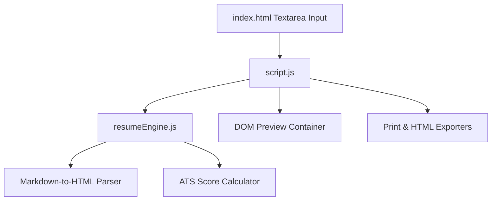

# Project Architecture — Markdown Resume Generator

---

## Overview

Markdown Resume Generator converts live plain-text Markdown into professional, ATS-friendly resume layouts. It features multiple template themes (Classic, Modern, Minimal), live split-screen preview, word counter, ATS completeness analyzer, and PDF/HTML export features.

---

## Purpose & Goals

- Enable quick resume authoring using plain Markdown markup.
- Provide real-time rendering into styled resume preview templates.
- Calculate ATS optimization scores based on standard resume sections.
- Export standalone, printable HTML files without external bundlers.
- Modularize resume parsing logic into UMD-compliant `resumeEngine.js`.

---

## Folder Structure

```
markdown-resume-generator/
├── index.html          # Split-pane layout shell, template selectors, live preview area
├── resumeEngine.js      # Markdown-to-HTML parser, inline styling engine, ATS score calculator
├── script.js           # Event listeners, preview updates, export triggers
├── style.css           # Modern dark UI controls, printable media styles, template themes
├── thumbnail.svg       # Card preview asset
└── ARCHITECTURE.md     # Architecture documentation
```

---

## System / Project Architecture Overview



---

## Component Breakdown

| File | Responsibility |
|---|---|
| `index.html` | Two-column split layout, theme selector options, action buttons, live preview area |
| `resumeEngine.js` | Core Markdown parser, regex inline element replacer, ATS score computation, HTML exporter |
| `script.js` | Input debouncing, template theme switcher, PDF trigger, local storage sync |
| `style.css` | Print media CSS rules (`@media print`), template variant styles, responsive split grid |

---

## Data Flow / Execution Flow

```
User types or edits Markdown in left editor pane
↓
script.js triggers updatePreview() on input event
↓
resumeEngine.parseMarkdownToHTML() parses text into semantic HTML nodes
↓
Parsed HTML rendered inside #resumePreview container
↓
Word count and ATS completeness score updated
```

---

## Key Features

- Real-time Markdown parser supporting headings (`#`, `##`, `###`), lists (`-`), bold (`**`), and links (`[]()`).
- Multiple visual themes (Slate, Emerald, Indigo, Amber).
- Template layouts (Classic, Modern, Minimal).
- Built-in ATS section checklist scoring (Summary, Skills, Experience, Education, Projects).
- One-click print / PDF export and standalone HTML document download.

---

## Technologies Used

| Technology | Purpose |
|---|---|
| HTML5 | Split pane container, template selectors |
| CSS3 | Print media styling, CSS template themes |
| Vanilla JavaScript (ES6+) | Resume Engine parser, DOM rendering, localStorage |

---

## File Responsibilities

### `index.html`
- Contains Markdown editor textarea, action control buttons, template selects, and live preview container.

### `resumeEngine.js`
- `parseMarkdownToHTML(markdown)` — Converts Markdown string into semantic HTML resume tags.
- `parseInlineMarkdown(text)` — Handles links, strong tags, and emphasis inline replacements.
- `calculateATSScore(markdown)` — Computes percentage score based on key resume section headers.
- `generateStandaloneHTML(markdown, template, theme)` — Generates printable HTML string wrapper.

### `script.js`
- `initializeResumeGenerator()` — Loads saved state from localStorage and binds handlers.
- `updatePreview()` — Evaluates Markdown input and updates DOM.

### `style.css`
- `@media print` rules, theme color palettes, and template layout rules.

---

## Design Decisions

- **UMD Engine Wrapper**: Encapsulated parsing in `resumeEngine.js` so Node test runners can validate parsing without DOM overhead.
- **Native Print CSS**: Uses native browser `window.print()` with custom print stylesheets for pixel-perfect PDF export without heavy external canvas libraries.

---

## Dependencies

None. Uses native web standards and vanilla JavaScript.

---

## Future Improvements

- Add drag-and-drop section reordering.
- Add multi-column layout template options.

---

## Known Limitations

- Complex nested tables are not supported in standard resume markdown syntax.

---

## Development Notes

- Unit test suite executed via `node --test tests/markdown-resume-generator.test.js`.

---

## License & Attribution

- **Project License:** MIT
- **Third-Party Assets:**
  - Google Fonts (Outfit & Fira Code) — Open Font License

---

## References

- [MDN Web Docs — Printing](https://developer.mozilla.org/en-US/docs/Web/Guide/Printing)
- [CommonMark Spec](https://commonmark.org/)
