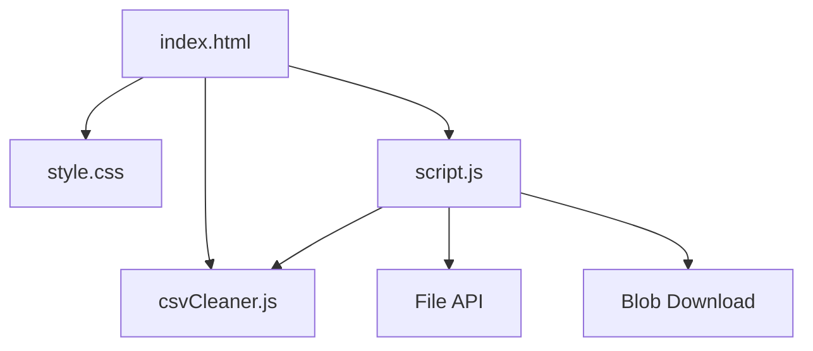

# CSV Data Cleaner Architecture

## Overview

CSV Data Cleaner is a client-side file utility that helps users clean pasted or uploaded CSV data. It parses headers and rows, trims whitespace, removes empty and duplicate rows, detects missing values, previews the cleaned table, and exports a cleaned CSV file without any backend service.

---

## Purpose & Goals

- Provide a lightweight CSV cleaning workflow directly in the browser.
- Keep parsing and cleaning rules in a pure JavaScript module for unit testing.
- Support common CSV edge cases such as quoted commas and escaped quotes.
- Match Cradle's mini-project pattern with plain HTML, CSS, and JavaScript.

---

## Folder Structure

```text
csv-data-cleaner/
├── index.html       # Entry point, controls, summary cards, and preview container
├── style.css        # Responsive file-tools styling and table states
├── script.js        # DOM events, file upload, rendering, and download handling
├── csvCleaner.js    # Pure CSV parsing, cleaning, analysis, and export logic
├── ARCHITECTURE.md  # Project architecture documentation
└── thumbnail.svg    # Generated gallery thumbnail
```

---

## System / Project Architecture Overview

The project is split into a pure engine and a browser UI layer. `csvCleaner.js` contains CSV parsing, cleanup, missing-value detection, and CSV export functions. `script.js` handles user input, file loading, preview rendering, summary cards, and downloads.



---

## Component Breakdown

| File | Responsibility |
|---|---|
| `index.html` | Provides the text area, file upload control, action buttons, summary cards, and cleaned table preview. |
| `style.css` | Defines the dark file-tools layout, responsive workspace, summary cards, and missing-value table styling. |
| `script.js` | Wires UI controls to the cleaner engine, reads uploaded files, renders summaries and tables, and downloads cleaned CSV. |
| `csvCleaner.js` | Parses CSV strings, trims fields, removes empty and duplicate rows, detects missing values, and exports CSV text. |

---

## Data Flow / Execution Flow

```text
User opens index.html
↓
Browser loads style.css, csvCleaner.js, then script.js
↓
script.js loads sample CSV and runs the cleaner
↓
CsvCleaner parses headers and rows
↓
CsvCleaner trims cells, removes empty rows, removes duplicates, and detects missing values
↓
script.js renders summary cards and the cleaned table preview
↓
User uploads, pastes, cleans, or downloads
↓
The matching event handler reruns the engine or exports the cleaned dataset
```

---

## Key Features

- Paste or upload CSV input.
- Header and row parsing with quoted field support.
- Extra whitespace trimming for headers and cells.
- Empty row removal.
- Duplicate row removal after trimming.
- Missing value detection with highlighted preview cells.
- Cleaned table preview with a 50-row display limit.
- Downloadable cleaned CSV export.

---

## Technologies Used

| Technology | Purpose |
|---|---|
| HTML5 | Semantic page structure and file input. |
| CSS3 | Responsive layout, summary cards, table preview, and dark theme. |
| Vanilla JavaScript | CSV parsing, cleaning, DOM updates, file reading, and export. |
| File API | Reads uploaded CSV files in the browser. |
| Blob API | Creates downloadable cleaned CSV output. |
| Node.js `node:test` | Unit tests for parsing, cleanup, and export formatting. |

---

## File Responsibilities

### `index.html`

- Defines the CSV text area and upload control.
- Provides action buttons for loading sample data, cleaning, and downloading.
- Contains summary metric cards for row counts, duplicate removal, empty row removal, and missing values.
- Provides the cleaned preview container.

### `csvCleaner.js`

- `parseCsv(text)` parses CSV text into headers and row arrays.
- `normalizeRowLength(row, length)` pads or truncates rows to match the header count.
- `trimCells(dataset)` removes surrounding whitespace from headers and cells.
- `removeEmptyRows(dataset)` removes rows where every cell is blank.
- `removeDuplicateRows(dataset)` removes exact duplicate rows after normalization.
- `detectMissingValues(dataset)` reports blank cells by row, column, and header.
- `cleanDataset(dataset, options)` runs the default cleaning pipeline and returns a summary.
- `exportCsv(dataset)` serializes cleaned data with correct quote escaping.
- `analyzeCsv(text, options)` parses and cleans text in one call.

### `script.js`

- Loads the built-in sample data on startup.
- Reads uploaded CSV files through `File.text()`.
- Calls `CsvCleaner.analyzeCsv` when the user cleans data.
- Updates the summary cards and preview table.
- Highlights missing cells in the preview.
- Exports the cleaned data through a generated Blob URL.

### `style.css`

- Defines the file-tools color palette and responsive page shell.
- Styles the source editor, upload control, action buttons, and status message.
- Styles summary metric cards and the scrollable table preview.
- Applies a missing-value treatment to blank preview cells.

---

## Design Decisions

- **Pure cleaner module** — parsing and cleaning logic lives outside the DOM so it can be tested with Node.js.
- **Small custom parser** — the parser handles the CSV cases needed by the mini project, including quoted commas and escaped quotes, without adding dependencies.
- **Normalization before cleanup** — rows are padded or truncated to the header length before trimming and deduplication, keeping preview and export columns consistent.
- **Preview limit** — the UI renders up to 50 rows so large pasted files stay responsive while still showing useful feedback.
- **No backend** — all work happens in the browser to keep user data local.

---

## Dependencies

None. This project uses only native browser APIs and Node.js built-ins for tests.

---

## Future Improvements

- Add per-column filters for trimming, dropping, or filling missing values.
- Allow users to choose whether duplicate detection is case-sensitive.
- Add delimiter detection for semicolon- or tab-separated files.
- Show downloadable cleaning reports alongside the cleaned CSV.

---

## Known Limitations

- The parser supports standard comma-separated data and does not auto-detect other delimiters.
- The preview displays the first 50 cleaned rows, although the full cleaned dataset is exported.
- Missing values are detected but not automatically filled.

---

## Development Notes

- Run the project through a local server from the repository root:
  ```bash
  python3 -m http.server 8000
  ```
- Run focused tests with:
  ```bash
  node --test tests/csv-data-cleaner.test.js
  ```
- Regenerate the project registry and thumbnail with:
  ```bash
  npm run build
  ```

---

## License & Attribution

- **Project License:** MIT, following the repository license.
- **Third-Party Assets:** None. The UI, logic, tests, and generated thumbnail are repository-native.

---

## References

- [RFC 4180: Common Format and MIME Type for CSV Files](https://datatracker.ietf.org/doc/html/rfc4180)
- [MDN Web Docs: File API](https://developer.mozilla.org/en-US/docs/Web/API/File)
- [MDN Web Docs: Blob](https://developer.mozilla.org/en-US/docs/Web/API/Blob)
