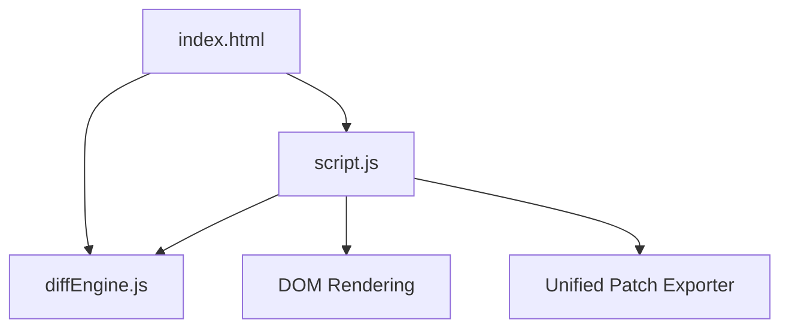

# Project Architecture — File Difference Visualizer

---

## Overview

File Difference Visualizer is a web-based utility for comparing two text files or code snippets side-by-side or in a unified inline format. It highlights line-by-line additions, deletions, and unchanged blocks with customizable diffing options (ignoring whitespace and case sensitivity) and standard patch file export.

---

## Purpose & Goals

- Provide a fast, framework-free in-browser text and code comparison engine.
- Support both side-by-side scroll-synchronized views and unified diff views.
- Enable option toggles for whitespace and case sensitivity filtering.
- Allow standard Git-compatible unified patch export.
- Maintain full testability via a UMD modular `diffEngine.js`.

---

## Folder Structure

```
file-difference-visualizer/
├── index.html          # Page markup shell and UI container
├── diffEngine.js       # Standalone LCS diffing engine and patch generator
├── script.js           # DOM manipulation and event handlers
├── style.css           # Modern dark-theme visual styling
├── thumbnail.svg       # Project card preview asset
└── ARCHITECTURE.md     # Architecture documentation
```

---

## System / Project Architecture Overview



---

## Component Breakdown

| File | Responsibility |
|---|---|
| `index.html` | Page markup, textareas, file input dropzones, diff view containers |
| `diffEngine.js` | Pure LCS line diffing algorithm, character diffing, diff statistics, patch builder |
| `script.js` | DOM event binding, file reader handling, view switching, and rendering |
| `style.css` | Flexbox/Grid layouts, scroll synchronization styles, syntax line coloring |

---

## Data Flow / Execution Flow

```
User inputs or uploads File A and File B
↓
User toggles diff options (whitespace, case sensitivity, view mode)
↓
script.js triggers DiffEngine.computeLineDiff(textA, textB, options)
↓
DiffEngine computes LCS matrix and builds line alignment array
↓
script.js formats HTML with line numbers and diff line classes
↓
DOM updates with side-by-side or unified view
```

---

## Key Features

- Side-by-side synchronized dual-pane scroll comparison.
- Unified patch view for inline diff analysis.
- Drag-and-drop file upload support.
- Ignore whitespace and ignore case sensitivity toggle switches.
- One-click unified `.patch` file export.

---

## Technologies Used

| Technology | Purpose |
|---|---|
| HTML5 | Semantic structure and text area inputs |
| CSS3 (Flexbox/Grid/CSS Variables) | Dark mode styling and split pane layouts |
| Vanilla JavaScript (ES6+) | LCS diffing engine and DOM state management |

---

## File Responsibilities

### `index.html`
- Defines text input areas, file browse buttons, view toggle buttons, option checkboxes, and diff containers.

### `diffEngine.js`
- `computeLineDiff(textA, textB, options)` — LCS line alignment engine.
- `computeCharDiff(str1, str2)` — Word/character level diff calculation.
- `computeDiffStats(alignment)` — Summary counter of additions and deletions.
- `generateUnifiedPatch(nameA, nameB, alignment)` — Formats standard `.patch` file text.

### `script.js`
- `renderDiff()` — Obtains inputs, calls `DiffEngine`, and populates line containers.
- `escapeHtml(str)` — Sanitizes line text for safe HTML rendering.

### `style.css`
- Custom dark color variables, diff highlight background colors, and monospace code styling.

---

## Design Decisions

- **UMD Engine Wrapper**: Encapsulates diff logic into `diffEngine.js` allowing direct inclusion in Node.js test scripts and browser runtime without transpilers.
- **LCS Alignment**: Uses Longest Common Subsequence matrix backtracking for accurate line diffs.

---

## Dependencies

None. Built entirely with native browser web standards and vanilla JavaScript.

---

## Future Improvements

- Add syntax highlighting for language-specific tokens (JS, Python, HTML).
- Support collapsible unchanged code blocks.

---

## Known Limitations

- High memory usage for massive files exceeding 100,000 lines due to O(N*M) DP matrix.

---

## Development Notes

- Node tests run directly against `diffEngine.js` using `node --test`.

---

## License & Attribution

- **Project License:** MIT
- **Third-Party Assets:**
  - Google Fonts (Outfit & Fira Code) — Open Font License

---

## References

- [MDN Web Docs — TextDecoder / TextEncoder](https://developer.mozilla.org/en-US/docs/Web/API/TextDecoder)
- [GNU Diffutils — LCS Diff Algorithm](https://www.gnu.org/software/diffutils/)

