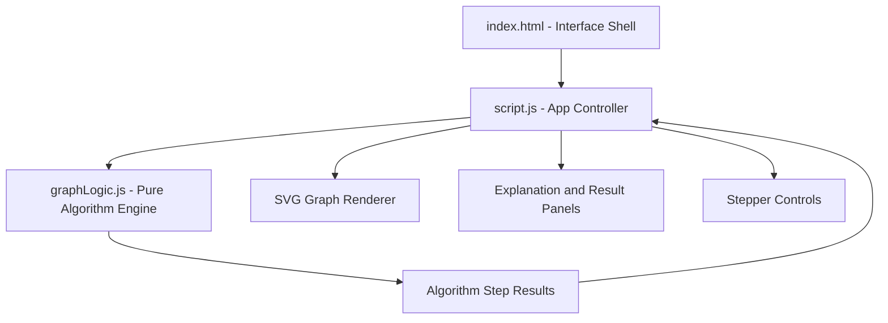

# Project Architecture - Graph Theory Explorer

This document describes the architecture and structure of the **Graph Theory Explorer** project located in `projects/math/graph-theory-explorer/`.

---

## Overview

Graph Theory Explorer is an interactive graph visualization tool for learning traversal and pathfinding algorithms. Users can add nodes, connect weighted edges, generate a random graph, and step through BFS, DFS, Prim's Minimum Spanning Tree, and Dijkstra's shortest path.

---

## Purpose & Goals

- Teach BFS, DFS, Prim's Minimum Spanning Tree, and Dijkstra's shortest path through visual playback
- Let users build and edit their own graphs interactively with weighted edges
- Keep the algorithm layer pure and DOM-free so it can be unit-tested in Node
- Provide step-by-step playback with human-readable explanations for each algorithm step

---

## Folder Structure

```text
projects/math/graph-theory-explorer/
+-- ARCHITECTURE.md    # Architecture documentation and implementation notes
+-- graphLogic.js      # Pure graph algorithms used by the UI and Node tests
+-- index.html         # App shell, controls panel, canvas workspace, and result panels
+-- script.js          # DOM controller, graph editing, rendering, and animation stepper
+-- style.css          # Responsive layout, graph canvas styles, cards, and theme styling
+-- thumbnail.svg      # Project thumbnail graphic
```

---

## System / Project Architecture Overview



---

## Component Breakdown

| File            | Role                                                                                                                                    |
| --------------- | --------------------------------------------------------------------------------------------------------------------------------------- |
| `index.html`    | Defines the control panel, algorithm buttons, node selectors, SVG canvas, explanation area, and result panel.                           |
| `style.css`     | Handles visual design, responsive layout, graph canvas styling, cards, controls, and theme presentation.                                |
| `script.js`     | Manages DOM state, user interactions, node/edge editing, random graph creation, algorithm selection, rendering, and animation playback. |
| `graphLogic.js` | Contains testable graph algorithms with no DOM dependency: adjacency building, BFS, DFS, Prim's MST, and Dijkstra.                      |

---

## Data Flow / Execution Flow

```text
User edits graph or selects an algorithm
        |
        v
script.js updates in-memory nodes and edges
        |
        v
graphLogic.js computes algorithm steps/results
        |
        v
script.js stores the step sequence for playback
        |
        v
SVG canvas, explanation text, and result panel update per step
```

---

## State Model

The project keeps graph state in browser memory:

```text
nodes: [{ id, x, y }]
edges: [{ from, to, weight }]
selectedAlgorithm: "bfs" | "dfs" | "mst" | "dijkstra"
currentMode: "add-node" | "add-edge"
steps: algorithm visualization timeline
currentStepIndex: active step in the timeline
```

`graphLogic.js` works with a pure algorithm shape:

```text
nodes: [{ id }]
edges: [{ from, to, weight }]
```

This separation keeps the algorithm layer independent from canvas coordinates and DOM rendering.

---

## Algorithm Layer

`graphLogic.js` exposes:

- `buildAdjacency(nodes, edges)` for creating an undirected weighted adjacency map.
- `bfs(nodes, edges, startId)` for breadth-first traversal steps.
- `dfs(nodes, edges, startId)` for depth-first traversal steps.
- `primMST(nodes, edges, startId)` for minimum spanning tree steps and total weight.
- `dijkstra(nodes, edges, startId, endId)` for shortest-path distances, path output, and relaxation steps.

The functions return structured step objects such as `visit`, `frontier-edge`, `tree-edge`, `settle`, and `relax`, which the UI uses to highlight graph elements during playback.

---

## Rendering Strategy

The SVG canvas is redrawn from the current `nodes`, `edges`, and active algorithm step. `script.js` applies visual classes and labels to communicate visited nodes, active edges, tree edges, settled nodes, and relaxed paths.

Playback controls use the generated step list to move forward, backward, restart, or automatically play through the visualization at the selected speed.

---

## Testing Notes

The graph algorithms are isolated in `graphLogic.js`, allowing Node tests to import and validate the algorithm behavior without requiring a browser DOM or SVG canvas.

---

## Key Features

- Add nodes and weighted edges directly on an SVG canvas, with drag-to-move repositioning
- Random graph generator (6 nodes in a ring plus chords) and "Clear All" for quick experiments
- Four algorithms: BFS, DFS, Prim's MST, and Dijkstra's shortest path
- Step-by-step playback with previous/next/play/restart controls and adjustable speed
- Per-step explanation text plus final results (MST weight, distance table, shortest path)
- Node highlighting for visited/current/settled/on-path states and edge classes for frontier/tree/path
- Dark/light theme toggle

---

## Technologies Used

| Technology | Purpose |
|---|---|
| HTML5 | Page shell, controls panel, SVG workspace |
| CSS3 (Grid, Flexbox, Custom Properties) | Layout, canvas styling, cards, theme |
| Vanilla JavaScript (ES6+) | Graph editing, rendering, animation playback |
| SVG | Graph rendering and state-based highlighting |
| Font Awesome 6.5.1 (CDN) | UI icons |
| Google Fonts (Space Grotesk, Inter, JetBrains Mono) | Typography |
| Cradle tokens.css | Shared design tokens |

---

## File Responsibilities

### `graphLogic.js`

- `buildAdjacency(nodes, edges)` — undirected weighted adjacency map from the pure graph shape
- `bfs(nodes, edges, startId)` — breadth-first traversal as `visit`/`frontier-edge` steps
- `dfs(nodes, edges, startId)` — depth-first traversal as `visit`/`frontier-edge` steps
- `primMST(nodes, edges, startId)` — MST `tree-edge` steps, edge list, and total weight
- `dijkstra(nodes, edges, startId, endId)` — `settle`/`relax` steps, distances map, and shortest path

### `script.js`

- `state` — in-memory nodes, edges, edit mode, algorithm, and playback state
- `addNode(x, y)` / `addEdge(fromId, toId)` — graph editing from canvas clicks (edge weight via prompt)
- `render()` — clears and redraws the SVG from nodes, edges, and the current step
- `computeSteps()` — calls the selected algorithm and stores the step timeline
- `goToStep(index)` / `startPlaying()` / `stopPlaying()` / `resetPlayback()` — playback engine
- `describeStep(step)` / `updateResultPanel()` — human-readable per-step explanations and final results
- Theme toggle and speed slider handlers

### `style.css`

- Cradle design tokens with `--theme-accent` overrides
- `.op-grid` / `.op-btn.active` — algorithm and edit-mode selectors
- `.graph-canvas` node/edge state classes (`.visited`, `.current`, `.on-path`, `.tree-edge`, `.path-edge`)
- `.player-toolbar` / `.step-progress-*` — visual stepper UI
- Responsive breakpoint at 960px

---

## Design Decisions

- **Pure algorithm engine separated from DOM** — `graphLogic.js` has no DOM dependency and exposes its API for both the browser and Node, so the algorithms can be verified headlessly.
- **Step-based results instead of final-only** — every algorithm returns an ordered array of step objects, letting the UI replay the computation rather than just showing the outcome.
- **SVG instead of Canvas** — nodes and edges are SVG elements, which makes per-element clicks, dragging, and class-based highlighting straightforward.
- **In-memory state model** — graph data lives in browser memory only (no persistence), and `graphLogic.js` consumes a simplified shape (`{id}` nodes, `{from, to, weight}` edges) independent of canvas coordinates.

---

## Dependencies

| Dependency | Version | How loaded | Purpose |
|---|---|---|---|
| Font Awesome | 6.5.1 | CDN (`<link>`) | UI icons |
| Space Grotesk / Inter / JetBrains Mono | — | Google Fonts CDN | Typography |
| Cradle tokens.css | — | Local stylesheet | Shared design tokens |
| Cradle BackToHome.js | — | Local script | Home navigation button |

No build step, package manager, or npm dependency.

---

## Future Improvements

- Add node and edge deletion directly from the canvas
- Support directed graphs and additional algorithms (e.g. A*, Floyd-Warshall)
- Persist graphs to localStorage
- Add touch/swipe support for mobile devices

---

## Known Limitations

- Undirected graphs only — every edge is treated as two-way
- Individual nodes and edges cannot be deleted; only "Clear All" resets the graph
- Edge weights are entered through a browser `prompt()` dialog
- The random graph always generates 6 nodes in a ring plus 2 random chords

---

## Development Notes

- Open `index.html` through a local server (e.g. `python3 -m http.server 8000`) so the shared Cradle assets (tokens.css, BackToHome.js) load correctly
- Run algorithm tests in Node: `node --test tests/graph-theory-explorer-logic.test.js`
- `graphLogic.js` is a standalone UMD module: `const { bfs } = require('./graphLogic.js')`
- No build step is required. Edit any file and refresh the browser.

---

## License & Attribution

- **Project License:** MIT
- **Third-Party Assets:**
  - 'Space Grotesk', 'Inter', and 'JetBrains Mono' fonts by [Google Fonts](https://fonts.google.com) (OFL License)
  - Font Awesome 6.5.1 icons by [Fonticons, Inc.](https://fontawesome.com) (CC BY 4.0)

---

## References

- [Breadth-first search — Wikipedia](https://en.wikipedia.org/wiki/Breadth-first_search)
- [Depth-first search — Wikipedia](https://en.wikipedia.org/wiki/Depth-first_search)
- [Prim's algorithm — Wikipedia](https://en.wikipedia.org/wiki/Prim%27s_algorithm)
- [Dijkstra's algorithm — Wikipedia](https://en.wikipedia.org/wiki/Dijkstra%27s_algorithm)
