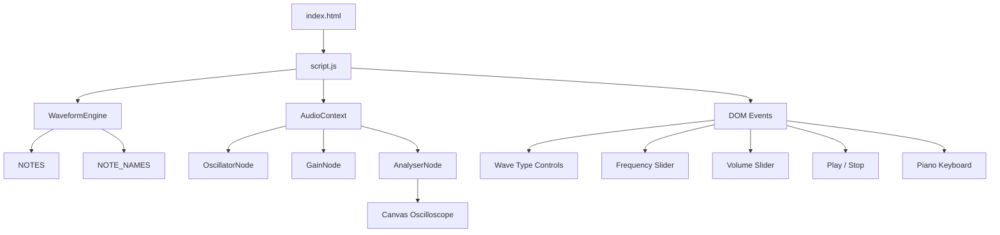

# Audio Waveform & Tone Generator Architecture

## Overview

Audio Waveform & Tone Generator is an interactive browser-based audio synthesizer that uses the Web Audio API to generate four waveform types: Sine, Square, Sawtooth, and Triangle. It provides real-time oscilloscope visualization using the HTML5 Canvas API and includes an on-screen piano keyboard spanning C4 to B4.

The project separates reusable waveform and note data from browser UI logic through `waveformEngine.js`. This keeps the engine independent of the DOM while `script.js` handles UI interaction, audio playback, and visualization.

---

## Purpose & Goals

* Demonstrate browser-based audio synthesis using native Web Audio APIs.
* Visualize generated audio waveforms in real time.
* Provide an interactive piano keyboard for exploring pitch and frequency.
* Separate reusable note and frequency data from DOM-dependent logic.
* Keep the project dependency-free and easy to run directly in a browser.
* Allow reusable engine data to be tested independently from the UI.

---

## Folder Structure

```text
audio-waveform-generator/
├── index.html            # Page structure and controls
├── style.css             # Layout, theme, controls, and piano styling
├── script.js             # UI orchestration and Web Audio logic
├── waveformEngine.js     # Reusable waveform and note data
├── ARCHITECTURE.md       # Project architecture documentation
└── thumbnail.svg         # Project gallery thumbnail
```

---

## System / Project Architecture Overview

The project uses a lightweight separation between reusable engine data and browser-specific application logic.



### Architecture Layers

#### Presentation Layer

* `index.html`
* `style.css`

Provides the page structure, controls, canvas, piano keyboard, labels, and visual styling.

#### Application Layer

* `script.js`

Coordinates DOM interaction, application state, Web Audio API lifecycle, waveform rendering, piano interaction, and keyboard shortcuts.

#### Engine/Data Layer

* `waveformEngine.js`

Contains reusable note and frequency data. The engine has no DOM dependencies and exposes its data through `WaveformEngine`.

---

## Component Breakdown

| File                | Responsibility                                                                           |
| ------------------- | ---------------------------------------------------------------------------------------- |
| `index.html`        | Page structure, audio controls, canvas, and piano keyboard container                     |
| `script.js`         | Web Audio API logic, UI state, event handling, waveform rendering, and piano interaction |
| `waveformEngine.js` | Reusable C4–B4 note and frequency definitions                                            |
| `style.css`         | Theme, layout, controls, canvas, piano keys, and responsive styling                      |
| `ARCHITECTURE.md`   | Project architecture and implementation documentation                                    |
| `thumbnail.svg`     | Project gallery thumbnail                                                                |

---

## Engine Layer

### `waveformEngine.js`

The engine contains pure note and frequency data that is independent of the DOM and Web Audio API.

It exposes the data through:

```javascript
globalThis.WaveformEngine = {
  NOTES,
  NOTE_NAMES,
};
```

### `NOTES`

`NOTES` contains seven piano notes from C4 through B4 with their corresponding equal-temperament frequencies using A4 = 440 Hz.

```javascript
[
  { note: "C4", freq: 261.63 },
  { note: "D4", freq: 293.66 },
  { note: "E4", freq: 329.63 },
  { note: "F4", freq: 349.23 },
  { note: "G4", freq: 392.0 },
  { note: "A4", freq: 440.0 },
  { note: "B4", freq: 493.88 },
]
```

### `NOTE_NAMES`

`NOTE_NAMES` provides a direct note-to-frequency lookup:

```javascript
{
  C4: 261.63,
  D4: 293.66,
  E4: 329.63,
  F4: 349.23,
  G4: 392.0,
  A4: 440.0,
  B4: 493.88
}
```

Keeping these values outside `script.js` allows the reusable data to be loaded independently of the browser UI.

---

## Application Layer

### `script.js`

`script.js` coordinates the user interface and browser APIs.

Its responsibilities include:

* Initializing the Web Audio API.
* Creating and connecting audio nodes.
* Starting and stopping audio playback.
* Updating oscillator waveform type.
* Updating oscillator frequency.
* Updating volume.
* Rendering the waveform on the canvas.
* Building the piano keyboard from `WaveformEngine.NOTES`.
* Handling piano key interaction.
* Handling keyboard shortcuts.
* Updating UI state and frequency displays.

The application accesses the engine data through the global engine object:

```javascript
const { NOTES, NOTE_NAMES } = globalThis.WaveformEngine;
```

This keeps reusable data separate from DOM and audio-specific application logic.

---

## Audio Processing Flow

The audio signal follows this processing chain:

```text
User interaction
      ↓
AudioContext
      ↓
OscillatorNode
      ↓
GainNode
      ↓
AnalyserNode
      ↓
Audio destination
```

The `AnalyserNode` also provides time-domain data to the Canvas renderer:

```text
AnalyserNode
      ↓
getByteTimeDomainData()
      ↓
Canvas
      ↓
Oscilloscope waveform
```

The oscillator generates the selected waveform, the gain node controls volume, and the analyser provides waveform data for visualization before the signal reaches the audio output.

---

## Data Flow / Execution Flow

```text
User opens index.html
        ↓
Browser loads style.css and waveformEngine.js
        ↓
script.js loads and accesses WaveformEngine
        ↓
Piano keyboard is generated from NOTES
        ↓
Canvas is initialized
        ↓
User selects waveform / frequency / volume
        ↓
User clicks Play or a piano key
        ↓
AudioContext is created after user interaction
        ↓
OscillatorNode → GainNode → AnalyserNode → destination
        ↓
requestAnimationFrame renders waveform data
        ↓
User clicks Stop or presses Space
        ↓
Audio playback stops and visualization is cleared
```

---

## Key Features

* Four waveform types: Sine, Square, Sawtooth, and Triangle.
* Frequency control from 20 Hz to 2000 Hz.
* Volume control from 0% to 100%.
* Real-time oscilloscope visualization.
* Seven-note piano keyboard from C4 to B4.
* Live frequency display for selected piano notes.
* Keyboard shortcuts:

  * `Space` — Play/Stop
  * `1–4` — Select waveform
  * `A–J` — Play piano notes
* Canvas waveform glow effect.
* Peak-level indicator.
* Responsive layout for smaller screens.
* No external JavaScript dependencies.

---

## Technologies Used

| Technology         | Purpose                                          |
| ------------------ | ------------------------------------------------ |
| HTML5              | Page structure and semantic markup               |
| CSS3               | Layout, styling, responsive design, and controls |
| Vanilla JavaScript | Application logic and event handling             |
| Web Audio API      | Audio synthesis and processing                   |
| Canvas API         | Real-time waveform visualization                 |

---

## File Responsibilities

### `index.html`

- Controls panel with waveform type buttons, frequency and volume sliders, and play/stop button
- Waveform oscilloscope canvas and its meta display
- Piano keyboard container (keys rendered by `script.js`)

### `script.js`

- `initAudio()` — creates the `AudioContext` and wires oscillator → gain → analyser → destination
- `start()` / `stop()` / `togglePlay()` — playback lifecycle management
- `drawWaveform()` — `requestAnimationFrame` oscilloscope loop using `getByteTimeDomainData()`
- `buildPiano()` — renders piano keys from `WaveformEngine.NOTES`
- `playNote()` — updates frequency and starts playback on mouse, touch, or keyboard input
- Global `keydown` handler for Space, number (1–4), and letter (A–J) shortcuts

### `waveformEngine.js`

- `NOTES` — the seven C4–B4 notes with equal-temperament frequencies (A4 = 440 Hz)
- `NOTE_NAMES` — direct note-to-frequency lookup used by keyboard shortcuts

### `style.css`

- Theme, layout, controls, canvas, and piano key styling

---

## Design Decisions

### Engine/UI Separation

Reusable note and frequency data is kept in `waveformEngine.js` rather than embedded directly in the UI logic. This keeps the engine independent of DOM operations and makes the data easier to reuse and test.

### Global Engine Export

The engine is exposed through:

```javascript
globalThis.WaveformEngine = {
  NOTES,
  NOTE_NAMES,
};
```

This allows browser-side code to access the engine without requiring a module bundler and allows the repository's Node-based tests to access the same engine data.

### Lazy AudioContext Creation

The `AudioContext` is created only after user interaction, satisfying browser autoplay restrictions that prevent audio from starting automatically.

### AnalyserNode Visualization

`AnalyserNode` provides time-domain samples that are consumed by the Canvas rendering loop to produce the oscilloscope display.

### Dependency-Free Implementation

The project uses native browser APIs instead of external audio or visualization libraries, keeping the mini-project lightweight and easy to understand.

---

## Dependencies

None.

The project uses only native browser APIs:

* Web Audio API
* Canvas API
* DOM APIs
* JavaScript Web APIs

---

## Known Limitations

* Only the white keys C4–B4 are available.
* Sharps and flats are not currently implemented.
* Only a single oscillator is used.
* Polyphonic playback is not supported.
* The frequency range is limited to 20–2000 Hz.
* The waveform visualization stops when audio playback stops.

---

## Future Improvements

* Add chromatic piano keys including sharps and flats.
* Support MIDI input.
* Add ADSR envelope controls.
* Support multiple oscillators and polyphony.
* Add a frequency-spectrum or spectrogram view.
* Add audio recording and WAV export.
* Add additional octave ranges.

---

## Development Notes

The project has no build step and can be run through a local development server.

For example:

```bash
npx live-server
```

A user interaction is required before creating or starting the `AudioContext` because of browser autoplay policies.

The reusable engine data can also be tested through the repository's Node-based test suite without loading the browser UI.

---

## License & Attribution

- **Project License:** MIT
- **Third-Party Assets:**
  - Outfit and JetBrains Mono (fonts) — Google Fonts CDN — UI typography

---

## References

* [MDN Web Audio API](https://developer.mozilla.org/en-US/docs/Web/API/Web_Audio_API)
* [MDN OscillatorNode](https://developer.mozilla.org/en-US/docs/Web/API/OscillatorNode)
* [MDN GainNode](https://developer.mozilla.org/en-US/docs/Web/API/GainNode)
* [MDN AnalyserNode](https://developer.mozilla.org/en-US/docs/Web/API/AnalyserNode)
* [MDN Canvas API](https://developer.mozilla.org/en-US/docs/Web/API/Canvas_API)
* [MDN AudioContext](https://developer.mozilla.org/en-US/docs/Web/API/AudioContext)
* [Equal Temperament](https://en.wikipedia.org/wiki/Equal_temperament)
