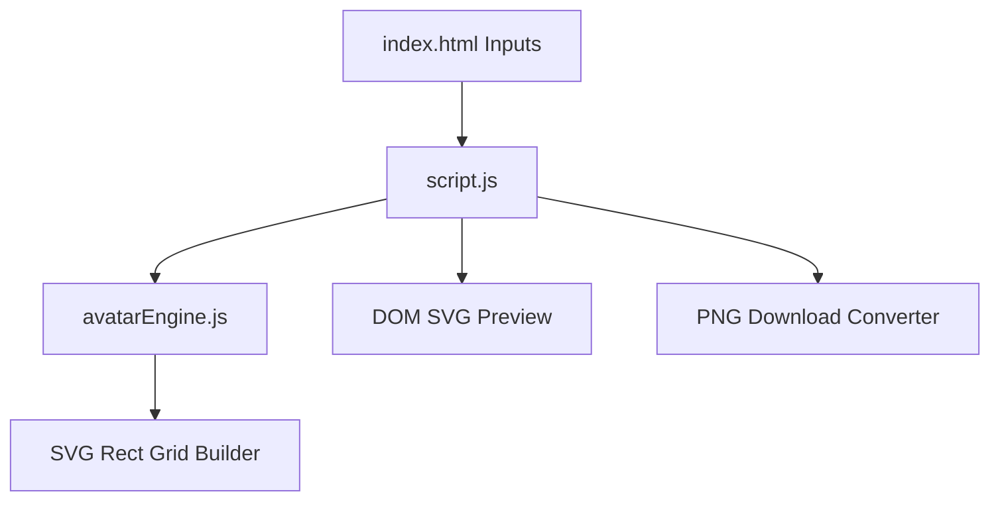

# Project Architecture — Avatar Creator

---

## Overview

Avatar Creator is a lightweight, interactive 16x16 pixel-art vector avatar generator. It allows users to customize background colors, skin tones, hair colors, and hair styles (Bowl Cut, Spiky, Bald) with live SVG rendering and PNG download capability.

---

## Purpose & Goals

- Provide a simple 16x16 pixel-art avatar designer running entirely in browser.
- Render scalable SVG vector graphics without external dependencies.
- Modularize SVG building logic into a standalone UMD `avatarEngine.js`.
- Enable color randomization and PNG image export.

---

## Folder Structure

```
avatar-creator/
├── index.html          # Controls layout, color inputs, SVG canvas shell
├── avatarEngine.js      # 16x16 grid math, SVG rect element builder, random palette generator
├── script.js           # DOM input binding, PNG export canvas rasterizer
├── style.css           # Center card layout, color picker controls
├── thumbnail.svg       # Card preview asset
└── ARCHITECTURE.md     # Architecture documentation
```

---

## System / Project Architecture Overview



---

## Component Breakdown

| File | Responsibility |
|---|---|
| `index.html` | Page header, color inputs, hair style selector, canvas preview box |
| `avatarEngine.js` | Grid coordinate constants, SVG string generator, random option builder |
| `script.js` | Input event listeners, DOM parser injection, XMLSerializer PNG exporter |
| `style.css` | Modern flex layout, button styles, centered preview box |

---

## Data Flow / Execution Flow

```
User selects color inputs or clicks Randomize
↓
script.js calls AvatarEngine.generateAvatarSVG(options)
↓
AvatarEngine loops over 16x16 grid layers (background, face, blush, mouth, eyes, hair)
↓
Raw SVG string parsed and inserted into DOM #avatar-svg
↓
User clicks Download -> SVG rasterized onto HTML5 Canvas to produce PNG download
```

---

## Key Features

- Real-time 16x16 pixel vector grid generation.
- Dynamic color customization for background, skin, and hair.
- Preset hair styles (Bowl Cut, Spiky, Bald).
- Instant palette randomizer.
- One-click PNG image download.

---

## Technologies Used

| Technology | Purpose |
|---|---|
| HTML5 | Color inputs, selection dropdowns, SVG element |
| CSS3 | Flex layout and UI styling |
| Vanilla JavaScript (ES6+) | Avatar Engine, DOM Parser, Canvas PNG rasterization |

---

## File Responsibilities

### `index.html`
- Color picker inputs, style select dropdown, preview SVG shell, download button.

### `avatarEngine.js`
- `generateAvatarSVG(options)` — Produces `<svg>` markup with 16x16 `<rect>` layers.
- `generateRandomOptions()` — Returns randomized hex color values and hair style index.

### `script.js`
- `renderAvatar()` — Fetches input values, invokes `AvatarEngine`, and updates DOM.

### `style.css`
- Centered container styling, color picker layout rules.

---

## Design Decisions

- **UMD Engine Extraction**: Separated grid generation logic into `avatarEngine.js` for standalone headless Node testing.
- **Layered Grid Rendering**: Built in strict z-index layer order (Background -> Face -> Blush -> Hair -> Mouth -> Eyes) for proper pixel-art occlusion.

---

## Dependencies

None. Built entirely using standard browser APIs and native SVG web standards.

---

## Future Improvements

- Add hats, glasses, and facial hair accessories.
- Support 32x32 high-resolution grid mode.

---

## Known Limitations

- Limited to 16x16 grid resolution by design.

---

## Development Notes

- Node tests run via `node --test tests/avatar-creator.test.js`.

---

## License & Attribution

- **Project License:** MIT
- **Third-Party Assets:** None.

---

## References

- [MDN Web Docs — Scalable Vector Graphics](https://developer.mozilla.org/en-US/docs/Web/SVG)
