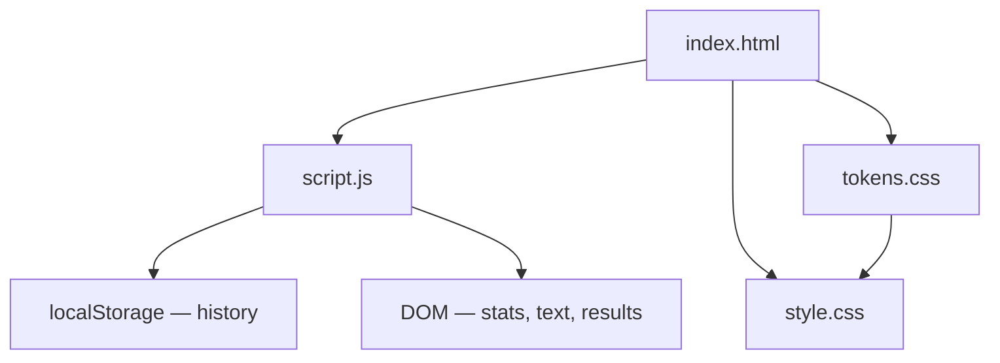

# Typing Speed Test — Architecture

> **Project:** Typing Speed Test  
> **Category:** Misc  
> **Cradle Path:** `projects/misc/typing-speed-test/`

---

## Overview

Typing Speed Test measures your typing speed (WPM), accuracy, and error count in real time. Choose from four difficulty levels (Easy, Medium, Hard, Code), set a test duration, and type against a displayed passage. Results are graded and stored in local history.

---

## Purpose & Goals

- Measure words per minute and accuracy with real-time feedback
- Provide multiple difficulty levels and test durations
- Highlight correct/incorrect characters as the user types
- Award grades based on WPM and accuracy combined
- Persist a history of recent test results in localStorage
- Offer a clean, distraction-free interface

---

## Folder Structure

```text
typing-speed-test/
├── index.html          # Stats bar, controls, text display, results, history
├── script.js           # Timer, WPM/accuracy engine, text banks, history, grades
├── style.css           # Character highlighting, stats, results, responsive design
└── ARCHITECTURE.md     # This file
```

---

## System / Project Architecture Overview



---

## Component Breakdown

| File | Responsibility |
|------|---------------|
| `index.html` | Stats bar (WPM, accuracy, time, errors), difficulty/time selectors, text display area, typing input, results card, history list |
| `script.js` | Text banks for 4 difficulties, countdown timer, WPM/accuracy calculation, character-by-character comparison, grade system, history persistence, input handling |
| `style.css` | Character highlighting (correct/incorrect/cursor), blinking cursor animation, stats bar, results grid, grade badges, responsive layout |

---

## Data Flow / Execution Flow

```text
User opens index.html
↓
script.js loads history from localStorage
↓
renderText() selects random passage for current difficulty
↓
User clicks textarea and starts typing
↓
startTimer() begins countdown; first keystroke starts the clock
↓
handleInput() fires on every keystroke:
  → Compares each typed character to expected character
  → Marks characters correct (green) or incorrect (red)
  → Updates error count, WPM, accuracy in real time
↓
Timer reaches 0 OR all characters typed
↓
finishTest() calculates final stats, determines grade
↓
Results section shown; history entry saved to localStorage
```

---

## Key Features

- **4 difficulty levels** — Easy (simple words), Medium (sentences), Hard (complex paragraphs), Code (programming snippets)
- **3 test durations** — 30s, 60s, 120s
- **Real-time WPM** — calculated as `(chars typed / 5) / elapsed minutes`
- **Real-time accuracy** — `(total keystrokes - errors) / total keystrokes * 100`
- **Character-by-character highlighting** — green for correct, red for incorrect, blinking cursor for current position
- **Raw WPM** — displayed in results as WPM before error penalty
- **Grade system** — S/A/B/C/D/F based on effective WPM × accuracy score
- **6 grades** — Typing Master (S), Excellent (A), Good (B), Average (C), Needs Practice (D), Keep Trying (F)
- **Test history** — last 20 results persisted in localStorage with timestamp
- **Paste prevention** — blocks clipboard paste to ensure authentic typing
- **Keyboard shortcut** — Escape to restart at any time
- **Responsive design** — works on desktop, tablet, and mobile

---

## Technologies Used

| Technology | Purpose |
|------------|---------|
| HTML5 | Page structure, semantic markup |
| CSS3 (Custom Properties, Grid, Animations) | Layout, character highlighting, responsive design |
| Vanilla JavaScript (ES6+) | Timer, WPM calculation, input handling, grade system |
| localStorage API | Test history persistence |
| Cradle `tokens.css` | Shared design token system |
| Cradle `BackToHome.js` | Back-to-home navigation |
| Font Awesome 6.x (CDN) | Icons |
| Google Fonts (Space Grotesk, Inter, JetBrains Mono) | UI and monospace typography |

---

## File Responsibilities

### `index.html`

- Stats bar with 4 real-time metric cards
- Difficulty selector (4 pill buttons with icons)
- Duration selector (3 pill buttons)
- Text display area with `<span>` per character (populated by JS)
- Hidden textarea for typing capture
- Results section (hidden by default) with 6 result metrics and grade badge
- History section with clear button

### `script.js`

- **`TEXTS` constant** — 4 arrays of text passages: easy (10), medium (8), hard (6), code (8)
- **`startTimer()`** — 1-second interval decrementing `timeLeft`; stops test at 0
- **`handleInput()`** — fires on every keystroke; compares typed vs expected char-by-char; updates spans; counts errors
- **`calculateWPM()`** — standard formula: `(chars / 5) / elapsedMinutes`
- **`calculateRawWPM()`** — WPM including error keystrokes
- **`calculateAccuracy()`** — `(totalKeystrokes - errors) / totalKeystrokes * 100`
- **`finishTest()`** — stops timer, calculates all metrics, determines grade, shows results, saves history
- **`getGrade()`** — computes score as `wpm * accuracy`; maps to S/A/B/C/D/F with emoji and label
- **`renderText()`** — creates individual `<span>` elements for each character with dataset index
- **History management** — `loadHistory()`, `saveHistory()`, `renderHistory()`, `clearHistory()`
- **Event listeners** — difficulty/duration buttons, input, paste prevention, Escape restart, clear history

### `style.css`

- Uses Cradle design tokens for all colors, spacing, shadows, radii
- Character highlighting: `.correct` (green), `.incorrect` (red bg), `.cursor` (blinking blue bar)
- `.space.incorrect` gets special red underline for visible space errors
- Stats bar: 4-column grid with monospace values
- Results grid: 3-column with large numbers; grade badges color-coded S-F
- Responsive: 2-column stats on tablet, stacked on mobile

---

## Design Decisions

- **Standard WPM formula** — 1 word = 5 characters, the industry standard for typing tests
- **No backspace restriction** — users can backspace and correct, but error count still tracks mistakes made
- **Paste blocked** — prevents cheating; the test measures genuine typing skill
- **Score = WPM × accuracy** — rewards both speed and precision; a fast but inaccurate typist scores lower than a moderate, accurate one
- **Grade thresholds** — designed so most casual typists land in C/B, with A/S requiring practice
- **History capped at 20** — prevents localStorage bloat while keeping meaningful trend data
- **Text per difficulty is pre-written** — avoids API calls or generation; bank is diverse enough for variety
- **Blinking cursor on current character** — provides clear visual guidance on where to type next

---

## Dependencies

| Dependency | Version | How loaded | Purpose |
|------------|---------|------------|---------|
| Cradle `tokens.css` | — | Local `<link>` | Design tokens |
| Cradle `BackToHome.js` | — | Local `<script>` | Navigation |
| Font Awesome | 6.5.1 | CDN | Icons |
| Google Fonts (Space Grotesk, Inter, JetBrains Mono) | — | Google Fonts CDN | Typography |

---

## Future Improvements

- Add a live WPM graph that updates every second during the test
- Implement custom text input so users can paste their own passages
- Add a "personal best" tracker across sessions
- Support multi-language text banks
- Add sound effects for correct/incorrect keystrokes
- Implement a leaderboard with peer comparison (would require backend)

---

## Known Limitations

- WPM is calculated from total keystrokes, not just correct ones, for raw WPM
- No backspace penalty beyond counting the error keystroke
- Text passages are English-only
- No collaborative or competitive mode
- No sound or haptic feedback

---

## Development Notes

- Open `index.html` through a local HTTP server if BackToHome.js requires it.
- History key: `ts_history_v1` in localStorage.
- Timer default: 30 seconds. Changeable via duration buttons.
- The textarea is visually hidden behind the text display but captures all keyboard input.

---

## License & Attribution

- **Project License:** MIT
- **Third-Party Assets:**
  - Font Awesome 6.5.1 — [Font Awesome](https://fontawesome.com) (free icons)
  - Space Grotesk, Inter, JetBrains Mono — [Google Fonts](https://fonts.google.com) (OFL License)
