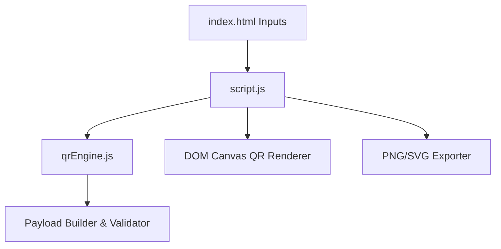

# Project Architecture — Advanced QR Code Generator

---

## Overview

Advanced QR Code Generator is a web application for creating, customizing, previewing, and downloading QR codes in real time. It supports payload construction for URLs, plain text, WiFi credentials, email, and phone numbers with custom color themes, logo overlays, and SVG/PNG image export.

---

## Purpose & Goals

- Provide a zero-dependency in-browser QR code builder.
- Support payload construction for URLs, text, contacts, and WiFi configurations.
- Allow customizable foreground/background color themes and error correction levels.
- Modularize logic into a standalone UMD `qrEngine.js`.

---

## Folder Structure

```text
advanced-qr-code-generator/
├── index.html          # Controls layout, preview container, export buttons
├── qrEngine.js         # Payload generator, input validator, preset storage
├── script.js           # Event listeners, canvas drawing, QR rendering
├── style.css           # Styling rules, color pickers, responsive design
├── thumbnail.svg       # Card preview asset
└── ARCHITECTURE.md     # Architecture documentation
```

---

## System / Project Architecture Overview



---

## Component Breakdown

| File | Responsibility |
|---|---|
| `index.html` | Page markup, payload textareas, color pickers, download controls |
| `qrEngine.js` | Payload builder for WiFi/vCard/URL, preset storage manager |
| `script.js` | DOM input bindings, QR matrix rendering loop, image download handler |
| `style.css` | Modern visual design, tab layouts, preview box styling |

---

## Data Flow / Execution Flow

```text
User inputs payload text or selects configuration options
↓
script.js validates payload via QREngine
↓
QR code matrix calculated and rendered on preview canvas
↓
User clicks Download PNG/SVG -> Image blob generated for download
```

---

## Key Features

- Payload presets for URLs, plain text, WiFi, and contact details.
- Custom foreground/background color pickers.
- Adjustable error correction levels (L, M, Q, H).
- PNG and SVG image download.

---

## Technologies Used

| Technology | Purpose |
|---|---|
| HTML5 | Form inputs, canvas element |
| CSS3 | Custom properties, dark theme styling |
| Vanilla JavaScript (ES6+) | QR Engine module, DOM events |

---

## File Responsibilities

### `index.html`
- Form controls for text input, size slider, color pickers, download buttons.

### `qrEngine.js`
- `buildPayload(type, data)` — Formats type-specific payload strings (e.g., WiFi `WIFI:S:...`).
- `validateInput(text)` — Sanitizes payload input.

### `script.js`
- Handles DOM input events and triggers preview canvas redraws.

### `style.css`
- Form container rules, visual theme styles.

---

## Design Decisions

- **UMD Engine Module**: Separated payload building into `qrEngine.js` for standalone Node unit testing.

---

## Dependencies

None. Built with standard browser APIs.

---

## Future Improvements

- Add custom logo image overlay in center of QR code.

---

## Known Limitations

- High error correction levels require larger grid dimensions.

---

## Development Notes

- Unit test suite run via `node --test tests/advanced-qr-code-generator.test.js`.

---

## License & Attribution

- **Project License:** MIT
- **Third-Party Assets:** None.

---

## References

- [MDN Web Docs — Canvas API](https://developer.mozilla.org/en-US/docs/Web/API/Canvas_API)
