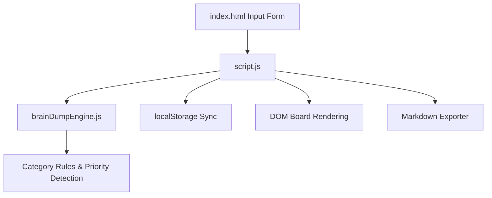

# Project Architecture — Brain Dump Collector

---

## Overview

Brain Dump Collector is a fast, distraction-free productivity app designed to capture unorganized thoughts, tasks, and ideas in real-time. It automatically categorizes notes using keyword analysis, assigns priority levels, enables instant tagging, and allows filtering, JSON import/export, and Markdown summary generation.

---

## Purpose & Goals

- Provide an instant single-input capture experience for mental clutter.
- Automatically categorize entries into Work, Study, Ideas, Health, Finance, Errands, or Personal.
- Infer item priority levels (High, Medium, Low) based on text urgency keywords.
- Support local storage persistence, filtering, and Markdown note export.
- Modularize state management and logic into a pure UMD `brainDumpEngine.js`.

---

## Folder Structure

```
brain-dump-collector/
├── index.html          # Entry shell, input form, category filters, thought board
├── brainDumpEngine.js  # Categorization engine, priority detector, search filter, export formatter
├── script.js           # DOM event handling, local storage syncing, board rendering
├── style.css           # Modern dark mode styling, board card layouts
├── thumbnail.svg       # Card preview asset
└── ARCHITECTURE.md     # Architecture documentation
```

---

## System / Project Architecture Overview



---

## Component Breakdown

| File                 | Responsibility                                                                  |
| -------------------- | ------------------------------------------------------------------------------- |
| `index.html`         | Thought capture textarea, category dropdowns, board container, template cards   |
| `brainDumpEngine.js` | Auto-categorization engine, priority rules, search filters, markdown generation |
| `script.js`          | Local storage state management, event listeners, board sorting & rendering      |
| `style.css`          | Flexbox/Grid layouts, glassmorphism cards, priority badge colors                |

---

## Data Flow / Execution Flow

```
User types thought in input field and submits form
↓
script.js passes text to BrainDumpEngine.autoCategorize() & detectPriority()
↓
New dump object created and prepended to state array
↓
State synced to browser localStorage
↓
DOM board re-renders with category cards and tag chips
```

---

## Key Features

- Rapid capture form with optional manual category override.
- Automated keyword-based category matching (Work, Study, Ideas, etc.).
- Urgent keyword detection for High / Medium / Low priority tagging.
- Real-time search query filtering and status filter (Open, Done, Pinned).
- One-click Markdown outline export and JSON backup/restore.
- Keyboard shortcuts: `Ctrl+Enter` / `Cmd+Enter` to submit new thought dump.

---

## Technologies Used

| Technology                | Purpose                                                |
| ------------------------- | ------------------------------------------------------ |
| HTML5                     | Form input controls, semantic article cards, templates |
| CSS3                      | Custom properties, dark theme styling, responsive grid |
| Vanilla JavaScript (ES6+) | Brain Dump Engine, regex tags extractor, localStorage  |

---

## File Responsibilities

### `index.html`

- Defines capture form, category select dropdowns, search bar, stat counters, and note template.

### `brainDumpEngine.js`

- `autoCategorize(text)` — Evaluates keyword occurrences to assign note category.
- `detectPriority(text)` — Scans for urgency tokens (`!`, `urgent`, `asap`, `today`).
- `filterDumps(dumps, query, category, priority)` — Multidimensional filtering function.
- `exportToMarkdown(dumps)` — Generates structured Markdown text export.

### `script.js`

- `initializeApp()` — Restores notes from `localStorage` and binds event handlers.
- `render()` — Filters notes and updates DOM count badges and card list.

### `style.css`

- Dark mode theme color variables, note card badges, and responsive board grid layout.

---

## Design Decisions

- **UMD Engine Separation**: Abstracted logic into `brainDumpEngine.js` for standalone Node unit test verification.
- **Client-Side Persistence**: Uses browser `localStorage` for privacy and offline usage without requiring a backend database.

---

## Dependencies

None. Uses native browser Web APIs and vanilla JavaScript.

---

## Future Improvements

- Add reminder deadline date-picker for actionable tasks.
- Add drag-and-drop board re-ordering across category columns.

---

## Known Limitations

- `localStorage` memory limit capped at ~5MB (approx 20,000 text dumps).

---

## Development Notes

- Unit test coverage executed via `node --test tests/brain-dump-collector.test.js`.

---

## License & Attribution

- **Project License:** MIT
- **Third-Party Assets:**
  - Google Fonts (Outfit & Fira Code) — Open Font License

---

## References

- [MDN Web Docs — Window.localStorage](https://developer.mozilla.org/en-US/docs/Web/API/Window/localStorage)
- [MDN Web Docs — HTML template element](https://developer.mozilla.org/en-US/docs/Web/HTML/Element/template)
