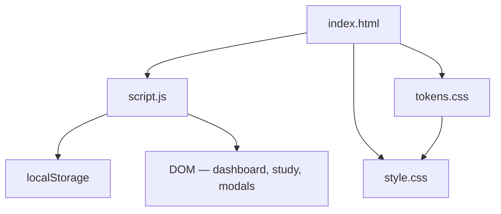

# Flashcard Studio — Architecture

> **Project:** Flashcard Studio  
> **Category:** Productivity  
> **Cradle Path:** `projects/productivity/flashcard-study/`

---

## Overview

Flashcard Studio is a self-contained flashcard application for creating, studying, and tracking learning progress. Users organize cards into decks, study them with a flip-card interface, and track mastery levels over time. All data persists in localStorage with no backend required.

---

## Purpose & Goals

- Provide a fast, distraction-free flashcard creation and study experience
- Track mastery per card (0–5 scale) with spaced-review-inspired progression
- Offer import/export so users can back up or share decks
- Deliver satisfying flip-card animations and keyboard-driven study
- Remain zero-dependency and require no build step

---

## Folder Structure

```text
flashcard-study/
├── index.html          # Dashboard, study view, modals, footer
├── script.js           # State, CRUD, study engine, import/export, keyboard shortcuts
├── style.css           # Deck grid, flashcard flip, modals, responsive
└── ARCHITECTURE.md     # This file
```

---

## System / Project Architecture Overview



---

## Component Breakdown

| File | Responsibility |
|------|---------------|
| `index.html` | Page structure: stats bar, deck grid, study view with flashcard, 3 modals (deck, card, detail), import/export buttons, footer |
| `script.js` | All application logic: data persistence, deck/card CRUD, study mode with shuffle and scoring, flip animation, import/export, keyboard shortcuts |
| `style.css` | Visual design: deck cards with progress bars, 3D flashcard flip, modals, responsive grid, Cradle token usage |

---

## Data Flow / Execution Flow

```text
User opens index.html
↓
script.js loads data from localStorage (or empty defaults)
↓
renderDashboard() — stats bar + deck grid
↓
User clicks "New Deck" → modal → submit → data saved → re-render
↓
User opens a deck → detail modal shows card list
↓
User adds cards via modal → saved → detail refreshes
↓
User clicks "Start Study" → cards shuffled → study view
↓
Space/click flips card → Arrow keys / buttons mark known/unknown
↓
All cards reviewed → session summary → mastery updated → saved
↓
Every action persists to localStorage
```

---

## Key Features

- **Deck management** — create, edit, delete named decks with optional descriptions
- **Card management** — add, edit, delete cards with front (question) and back (answer)
- **Mastery tracking** — 0–5 scale per card; increases on "Know", decreases on "Don't Know"
- **Progress bars** — visual mastery indicator per deck (percentage of cards at mastery ≥ 3)
- **Study mode** — cards shuffled randomly; flip animation with CSS 3D transform
- **Keyboard shortcuts** — Space to flip, Arrow keys / J/K to mark known/unknown, Escape to exit
- **Session scoring** — tracks known/unknown counts and accuracy percentage
- **Session counter** — total study sessions incremented and displayed in stats
- **Import/Export** — JSON file export of all decks; import to merge decks
- **Auto-persist** — all state saved to localStorage on every mutation
- **Responsive design** — works on desktop, tablet, and mobile

---

## Technologies Used

| Technology | Purpose |
|------------|---------|
| HTML5 | Page structure, semantic markup, aria attributes |
| CSS3 (Custom Properties, Grid, Flexbox, 3D transforms) | Layout, flip animation, responsive design |
| Vanilla JavaScript (ES6+) | Application logic, DOM manipulation, state management |
| localStorage API | Persistent storage for decks, cards, and session count |
| Cradle `tokens.css` | Shared design token system |
| Cradle `BackToHome.js` | Back-to-home navigation |
| Font Awesome 6.x (CDN) | Icons |
| Google Fonts (Space Grotesk, Inter) | Typography |

---

## File Responsibilities

### `index.html`

- Defines four main sections: stats bar, deck grid, study view, modals
- Three modals: create/edit deck, add/edit card, deck detail (with card list)
- Uses `aria-label`, `role="button"`, `tabindex` for accessibility
- File import input hidden; triggered by button click
- Loads Cradle tokens and BackToHome component

### `script.js`

- **`loadData()` / `saveData()`** — localStorage read/write with try/catch
- **`uid()`** — generates unique IDs using timestamp + random string
- **`renderDashboard()`** — updates stats bar, renders deck cards with progress bars
- **Deck CRUD** — `openDeckModal()`, submit handler creates/updates, `deleteDeck()`
- **Card CRUD** — `openCardModal()`, submit handler creates/updates, `deleteCard()`
- **`openDeckDetail()`** — modal showing card list with mastery dots, edit/delete per card
- **`startStudy()`** — shuffles cards, enters study view, calls `showStudyCard()`
- **`showStudyCard()`** — displays front/back of current card, updates progress
- **`flipCard()`** — toggles CSS class for 3D flip animation
- **`markKnown()` / `markDontKnow()`** — adjusts mastery, records in session, advances
- **`finishStudy()`** — increments session count, shows summary with accuracy
- **`exportDecks()` / `importDecks()`** — JSON blob download / FileReader import
- **Keyboard handler** — Space, ArrowRight, ArrowLeft, J, K mapped to study actions

### `style.css`

- Uses Cradle design tokens (`--cradle-*`) for all colors, spacing, shadows, radii
- Deck cards with hover lift effect and gradient progress bars
- Flashcard flip uses `perspective`, `transform-style: preserve-3d`, `backface-visibility: hidden`
- Study buttons use pill shape with color-coded borders (green/red/blue)
- Modal system with overlay, centered box, max-height scroll
- Card list in detail view with numbered items and mastery dot indicators
- Responsive: single column below 768px, stacked buttons below 480px

---

## Design Decisions

- **Mastery scale (0–5)** — simple integer scale avoids complexity of full spaced-repetition algorithms while still tracking progress
- **Random shuffle (not SR scheduling)** — keeps study sessions varied without requiring a scheduling algorithm; mastery still accumulates over sessions
- **3D flip animation** — CSS `transform: rotateY(180deg)` with `preserve-3d` provides a tactile, satisfying card flip without JavaScript animation libraries
- **Modal-based detail view** — avoids page navigation; keeps the user in context on the dashboard
- **Import appends, not replaces** — merged decks rather than overwriting, so users can combine decks from different sources
- **No external dependencies** — the entire app runs from a single HTML page with vanilla JS, consistent with Cradle's zero-build philosophy
- **Keyboard-first study** — Space/arrows allow rapid-fire study without touching the mouse

---

## Dependencies

| Dependency | Version | How loaded | Purpose |
|------------|---------|------------|---------|
| Cradle `tokens.css` | — | Local `<link>` | Design tokens |
| Cradle `BackToHome.js` | — | Local `<script>` | Navigation |
| Font Awesome | 6.5.1 | CDN | Icons |
| Google Fonts (Space Grotesk, Inter) | — | Google Fonts CDN | Typography |

---

## Future Improvements

- Add a full spaced-repetition scheduler (SM-2 algorithm) with optimal review intervals
- Support rich text or Markdown in card front/back
- Add image attachments to cards
- Implement deck sharing via URL-encoded JSON
- Add a " cram mode" that focuses only on low-mastery cards
- Show per-card review history and time-between-reviews

---

## Known Limitations

- No spaced-repetition scheduling — mastery increases/decreases linearly
- No rich text or images in cards — text only
- No collaborative or cloud features — fully local
- Shuffle is purely random — no weighting toward weak cards
- Mastery resets if localStorage is cleared

---

## Development Notes

- Open `index.html` through a local HTTP server if BackToHome.js requires it.
- Storage key: `fc_studio_v1` in localStorage.
- Default mastery threshold for "mastered": 3 out of 5.
- Study session accuracy is calculated as `known / (known + unknown) * 100`.

---

## License & Attribution

- **Project License:** MIT
- **Third-Party Assets:**
  - Font Awesome 6.5.1 — [Font Awesome](https://fontawesome.com) (free icons)
  - 'Space Grotesk' and 'Inter' fonts — [Google Fonts](https://fonts.google.com) (OFL License)
