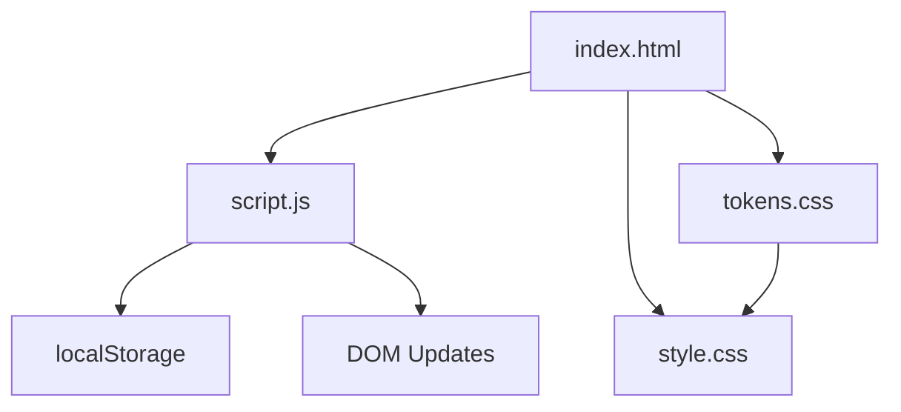

# Unit Converter — Architecture

> **Project:** Unit Converter  
> **Category:** Productivity  
> **Cradle Path:** `projects/productivity/unit-converter/`

---

## Overview

Unit Converter is a fast, accurate, client-side conversion tool that supports 8 categories (Length, Weight, Temperature, Volume, Speed, Data, Area, Time) with over 70 individual units. It provides real-time bidirectional conversion, formula display, a quick-reference table, and persistent conversion history. The tool is built with vanilla HTML, CSS, and JavaScript with no external dependencies, following the Cradle project conventions.

---

## Purpose & Goals

- Provide instant unit conversions across the most commonly used measurement categories
- Display the mathematical formula or conversion factor for every conversion
- Keep a local history of recent conversions that persists across sessions via localStorage
- Offer keyboard shortcuts for power users (swap units, reset, copy result)
- Remain dependency-free and require no build step

---

## Folder Structure

```text
unit-converter/
├── index.html          # Page shell, semantic HTML, loads scripts & tokens
├── script.js           # Conversion engine, UI wiring, history, keyboard shortcuts
├── style.css           # All layout and visual styling using Cradle design tokens
└── ARCHITECTURE.md     # This file
```

---

## System / Project Architecture Overview

The project follows a clean separation of concerns with three files:

1. `index.html` defines the semantic structure and loads shared Cradle UI tokens.
2. `style.css` handles all presentation using CSS custom properties from Cradle tokens.
3. `script.js` owns all behaviour: unit data, conversion logic, DOM manipulation, history persistence, and keyboard shortcut handling.

There is no build step — the browser loads files directly. Shared Cradle components (`tokens.css`, `BackToHome.js`) are referenced via relative paths.



---

## Component Breakdown

| File | Responsibility |
|------|---------------|
| `index.html` | Page structure, semantic markup, category tabs, converter panel, reference table, history panel, loads shared UI tokens |
| `script.js` | Unit data definitions, conversion engine, category switching, history management (localStorage), keyboard shortcuts, formula display |
| `style.css` | Layout, component styling, responsive breakpoints, animations, all using Cradle design tokens |
| `tokens.css` | Shared Cradle design token system (loaded from `src/components/ui/`) |

---

## Data Flow / Execution Flow

```text
User opens index.html
↓
Browser loads tokens.css → style.css → script.js
↓
init() runs: switches to "length" category, populates selects, renders table & history
↓
User enters a value in the "From" input
↓
performConversion() fires on every keystroke
↓
convert() engine resolves via ratio-based conversion (or special temperature logic)
↓
Result rendered in "To" input; formula displayed below
↓
After 600ms debounce, entry added to history → localStorage → history panel re-renders
```

---

## Key Features

- **8 conversion categories:** Length, Weight, Temperature, Volume, Speed, Data, Area, Time
- **70+ individual units** with accurate conversion factors
- **Real-time conversion** — results update on every keystroke
- **Bidirectional conversion** — swap from/to units with a button or keyboard shortcut
- **Formula display** — shows the exact mathematical relationship (e.g., `1 m = 3.28084 ft`)
- **Quick reference table** — displays a 5×5 matrix of conversions for the active category
- **Conversion history** — last 30 conversions persisted in localStorage with timestamps
- **Copy to clipboard** — one-click or `Ctrl+Shift+C` shortcut
- **Keyboard shortcuts** — `S` to swap, `Esc` to reset, `Ctrl+Shift+C` to copy
- **Responsive design** — works on mobile, tablet, and desktop
- **Dark theme** — uses Cradle's dark design token system by default

---

## Technologies Used

| Technology | Purpose |
|------------|---------|
| HTML5 | Page structure and semantic markup |
| CSS3 (Custom Properties, Grid, Flexbox) | Layout and responsive design using Cradle tokens |
| Vanilla JavaScript (ES6+) | Conversion logic, DOM manipulation, history |
| localStorage API | Persisting conversion history across sessions |
| Cradle `tokens.css` | Shared design token system |
| Cradle `BackToHome.js` | Shared back-to-home navigation component |
| Font Awesome 6.x (CDN) | Icons for category tabs and UI elements |
| Google Fonts (Space Grotesk, Inter) | Typography |

---

## File Responsibilities

### `index.html`

- Defines the page shell with header, category tabs, converter panel, reference table, history, and footer
- Loads shared Cradle `tokens.css` and `BackToHome.js`
- Loads Font Awesome icons and Google Fonts
- Uses semantic HTML5 elements (`<main>`, `<header>`, `<nav>`, `<section>`, `<footer>`)
- Provides `aria-label` attributes for accessibility

### `script.js`

- **`UNITS` constant** — Complete data model for all 8 categories and 70+ units, including labels, abbreviations, and conversion factors to a base unit
- **`tempConvert` / `tempFormula`** — Special-case conversion functions and formula strings for temperature (non-ratio-based)
- **`convert(value, fromKey, toKey, category)`** — Core conversion engine; delegates to ratio math or temperature special case
- **`getFormula(fromKey, toKey, category)`** — Returns human-readable formula string for display
- **`performConversion()`** — Reads input, converts, renders result, shows formula, debounces history entry
- **`renderRefTable(category)`** — Builds a 5×5 conversion matrix table for the active category
- **`addToHistory()` / `renderHistory()` / `clearHistory()`** — History management with localStorage persistence, deduplication, and capped size (30 entries)
- **`switchCategory(category)`** — Handles category tab switching, repopulates selects, resets state
- **`swapUnits()`** — Swaps from/to units and moves result to input
- **Keyboard shortcuts** — Global `keydown` listener for `S`, `Escape`, and `Ctrl+Shift+C`

### `style.css`

- Uses Cradle design tokens (`--cradle-*`) throughout for consistent theming
- Implements the converter panel layout with CSS Grid (3-column desktop, 1-column mobile)
- Styles category tabs as pill buttons with active state
- Provides responsive breakpoints at 768px and 480px
- Animates the swap button with a 180° rotation on hover
- Styles the formula bar with monospace font and accent background

---

## Design Decisions

- **No external conversion library** — All conversion factors are defined inline in the `UNITS` constant for full control and zero dependencies.
- **Base-unit conversion model** — Each unit defines a `toBase` factor; conversion between any two units goes through the base, enabling O(1) conversion without lookup tables.
- **Temperature as special case** — Temperature conversions are not ratio-based, so they use dedicated functions rather than the `toBase` model.
- **Debounced history** — History entries are only written after a 600ms pause in typing, preventing excessive localStorage writes during rapid input.
- **Capped history** — Maximum 30 entries to keep localStorage lean and the UI uncluttered.
- **Read-only result field** — The "To" field is read-only to enforce unidirectional UX; the swap button provides bidirectional capability.
- **No build step** — All files are loaded directly by the browser, consistent with the Cradle project philosophy.

---

## Dependencies

| Dependency | Version | How loaded | Purpose |
|------------|---------|------------|---------|
| Cradle `tokens.css` | — | Local `<link>` tag | Shared design token system |
| Cradle `BackToHome.js` | — | Local `<script>` tag | Back-to-home navigation |
| Font Awesome | 6.5.1 | CDN (`<script>` tag) | Icons for categories and UI |
| Google Fonts (Space Grotesk, Inter) | — | Google Fonts CDN | UI typography |

---

## Future Improvements

- Add a "favourite units" feature to pin frequently used unit pairs
- Support currency conversion via a live exchange rate API
- Add scientific notation input mode for very large or small values
- Implement a "conversion chain" feature (e.g., meters → feet → inches in one expression)
- Add PWA support with offline capability via a service worker

---

## Known Limitations

- No currency conversion (would require an external API)
- Temperature conversions do not support custom offsets or complex formulas
- The reference table only shows the first 5 units per category for space reasons
- No drag-and-drop or native share API integration

---

## Development Notes

- Open `index.html` through a local HTTP server (e.g., `python3 -m http.server 8000`), not by double-clicking the file.
- No build step is required. Edit the files and refresh the browser.
- All conversion factors in the `UNITS` constant are sourced from NIST and Wikipedia references.
- The project uses the same localStorage key (`uc_history`) across all categories.

---

## License & Attribution

- **Project License:** MIT
- **Third-Party Assets:**
  - Font Awesome 6.5.1 (free icons) — [Font Awesome](https://fontawesome.com)
  - 'Space Grotesk' and 'Inter' fonts — [Google Fonts](https://fonts.google.com) (OFL License)

---

## References

- [NIST — Units of Measurement](https://www.nist.gov/pml/owm/metric-si/units-measurement)
- [Wikipedia — Conversion of units](https://en.wikipedia.org/wiki/Conversion_of_units)
- [MDN Web Docs — localStorage](https://developer.mozilla.org/en-US/docs/Web/API/Window/localStorage)
