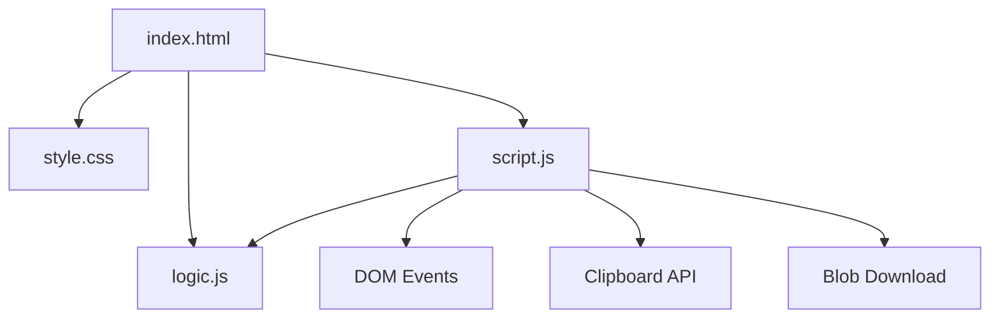

# JSON Converter Architecture

## Overview

JSON Converter is a client-side tool that parses, validates, formats, and converts JSON into three popular data formats — YAML, CSV, and XML — all within the browser with zero external dependencies. It provides a split-pane code editor experience with real-time syntax highlighting, error reporting at the line and column level, and one-click copy/minify/download actions.

---

## Purpose & Goals

- Provide a fast, offline JSON validator with precise error locations (line + column)
- Support lossless conversion to YAML, CSV, and XML without server round-trips
- Demonstrate pure-function core logic separated from DOM orchestration for testability
- Keep the codebase small and dependency-free so a contributor can read it in under 20 minutes

---

## Folder Structure

```
json-converter/
├── index.html       # Entry point: split-pane layout, controls, action buttons
├── style.css        # Dark-theme styling matching dev-tools conventions
├── logic.js         # Pure functions: parse, validate, convert, highlight (UMD export)
├── script.js        # UI orchestration: event binding, highlight sync, toast, clipboard
├── ARCHITECTURE.md  # This file
└── thumbnail.svg    # Project card thumbnail for the gallery
```

---

## System / Project Architecture Overview

The project follows a strict separation of concerns between pure logic and UI orchestration:

- **`logic.js`** contains only pure functions with no DOM references. It handles JSON parsing with detailed error extraction, serialization to YAML/CSV/XML, formatting/minification, and syntax highlighting. It exports via a UMD wrapper so the same functions work in the browser (script tag) and Node.js (require) for unit testing.
- **`script.js`** owns all DOM references, event listeners, clipboard access, and UI state. It calls into `logic.js` for every transformation.
- **`index.html`** provides the semantic shell and loads both scripts.
- **`style.css`** handles all presentation using the repository's shared dark-theme palette.



---

## Component Breakdown

| File         | Responsibility                                                                          |
| ------------ | --------------------------------------------------------------------------------------- |
| `index.html` | Page shell, split-pane layout, format toggles, action buttons                           |
| `logic.js`   | JSON parsing/validation, YAML/CSV/XML serialization, format/minify, syntax highlighting |
| `script.js`  | DOM references, event binding, highlight sync, error display, clipboard, download       |
| `style.css`  | Dark-theme layout, editor pane styling, responsive breakpoints                          |

---

## Data Flow / Execution Flow

```

User opens index.html
↓
Browser loads style.css → logic.js → script.js
↓
script.js loads sample JSON into textarea
↓
syncHighlight() + onInput() fire
↓
onInput calls parseJSON() from logic.js
↓
If valid → renderOutput() converts via toYaml/toCsv/toXml
↓
Output is displayed in the right pane
↓
User types / picks format / clicks action
↓
Event handler → logic call → DOM update

```

---

## Key Features

- Real-time JSON syntax validation with line and column error reporting
- Three output formats: YAML, CSV, XML with one-click toggle
- Syntax-highlighted input pane using a transparent-textarea overlay technique
- Format (pretty-print) and Minify buttons for the input JSON
- Copy to clipboard and Download as `.yaml` / `.csv` / `.xml` file
- Keyboard shortcuts: `Tab` inserts 2-space indentation in the editor
- Responsive layout: side-by-side panes on desktop, stacked on mobile

---

## Technologies Used

| Technology                              | Purpose                                      |
| --------------------------------------- | -------------------------------------------- |
| HTML5                                   | Page structure and semantic markup           |
| CSS3 (Grid, Flexbox, Custom Properties) | Layout, editor overlay, responsive design    |
| Vanilla JavaScript (ES6+)               | Logic, DOM manipulation, clipboard, Blob API |
| Node.js `node:test`                     | Unit testing of `logic.js` functions         |

---

## File Responsibilities

### `index.html`

- Split-pane layout with `.editor-wrapper` (textarea + highlight overlay) and `.output-content` (pre)
- Format toggle button group (YAML / CSV / XML)
- Action button bar (Format, Minify, Copy, Download)
- Error panel below the controls for parse-error display
- Toast notification container (injected dynamically)

### `logic.js`

- `parseJSON(text)` — wraps `JSON.parse` with detailed error extraction (message, line, column)
- `toYaml(obj)` — recursive serializer; handles scalars, sequences, mappings with proper quoting
- `toCsv(obj)` — flattens nested objects via dot notation, collects all keys for homogeneous CSV
- `toXml(obj, rootName)` — recursive serializer; sanitizes element names, escapes text content
- `formatJSON(text)` / `minifyJSON(text)` — parse + re-stringify with/without whitespace
- `highlightJSON(text)` — character-level tokenizer producing `<span>`-wrapped HTML for syntax coloring
- UMD wrapper for dual browser/Node.js use

### `script.js`

- `onInput()` — main pipeline: parse → render output or show error
- `syncHighlight()` — re-run syntax highlighting on the transparent overlay layer
- `renderOutput(obj)` — dispatches to the active format serializer
- Format toggle handlers — switch `currentFormat` and re-render
- Format / Minify button handlers — transform input text in place
- Copy handler — `navigator.clipboard.writeText` with fallback
- Download handler — `Blob` → object URL → auto-click
- `showError()` / `hideError()` — toggle error panel and badge
- `showToast()` — ephemeral notification with fade animation
- Tab key handler — inserts 2 spaces at cursor position

### `style.css`

- Dark-theme palette: `#020617` / `#0f172a` backgrounds, `#1e293b` / `#334155` borders
- Gradient card header using `linear-gradient(90deg, #38bdf8, #818cf8)`
- Editor overlay technique: transparent `textarea` over `pre.highlight-layer`
- Format toggle pill group with active gradient state
- Action buttons with hover lift effect
- Toast notification positioning and animation
- Responsive breakpoint at 800px for stacked mobile layout

---

## Design Decisions

- **Pure logic separation** — all conversion, validation, and highlighting lives in `logic.js` with zero DOM dependencies. This makes the core trivially testable via Node.js and keeps `script.js` thin.
- **UMD wrapper in logic.js** — the same file can be `<script>`-loaded in the browser and `require()`-d in Node.js tests without any build step or bundler.
- **Overlay-based syntax highlighting** — the textarea is rendered with transparent text while a `<pre>` element behind it shows the highlighted version. This preserves native textarea behaviour (cursor, selection, scrolling) while still rendering coloured syntax.
- **No framework** — vanilla JS keeps the learning curve flat and avoids a build step, consistent with all other Cradle dev-tools projects.
- **Error reporting via JSON.parse internals** — native `JSON.parse` errors include a character position; the parser back-computes line/column from that position, giving precise feedback without a custom tokenizer.

---

## Dependencies

None. This project uses only native browser APIs (DOM, Clipboard, Blob) and Node.js built-in modules (`node:test`, `node:assert`) for testing — no external libraries are required.

---

## Future Improvements

- Add CSV delimiter selection (comma, tab, semicolon)
- Support XML attribute inference for primitive values
- Add a raw/diff view showing the byte-size difference between original and minified output
- Persist the most recent input and format choice to localStorage
- Add drag-and-drop file loading for the input pane

---

## Known Limitations

- CSV output flattens nested objects with dot notation, which can produce ambiguous columns for deeply nested or variably-structured data
- XML output uses a fixed root element name (`<root>`) unless called programmatically with a custom name
- YAML output does not support anchors, aliases, or multi-line string block literals (`|`, `>`)

---

## Development Notes

- Open `index.html` through a local server (e.g. `npx live-server` or `python3 -m http.server`) for the best experience; the file:// protocol works for basic use but may restrict some APIs.
- Run tests with Node.js built-in test runner:
  ```
  node --test tests/json-converter.test.js
  ```
- `logic.js` exports via UMD so it can be tested directly:
  ```
  node -e "const l = require('./logic.js'); console.log(l.toYaml({a:1}))"
  ```
- No build step is required. Edit any file and refresh the browser.

---

## License & Attribution

- **Project License:** MIT
- **Third-Party Assets:**
  - "Inter" and "JetBrains Mono" fonts by [Google Fonts](https://fonts.google.com) (OFL License)

---

## References

- [YAML 1.2 Specification](https://yaml.org/spec/1.2.2/) — reference for YAML serialization rules
- [RFC 4180 — Common Format and MIME Type for CSV Files](https://datatracker.ietf.org/doc/html/rfc4180) — CSV escaping rules
- [XML 1.0 Specification](https://www.w3.org/TR/xml/) — element naming and character escaping rules
- [Coding Train — Code Editor with Syntax Highlighting](https://thecodingtrain.com/) — inspiration for the textarea-overlay technique
