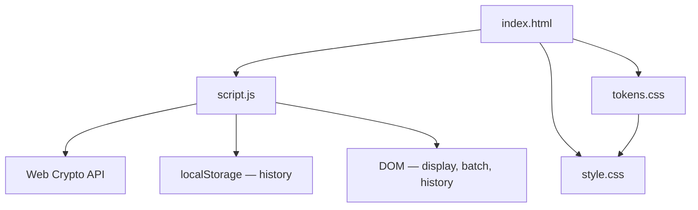

# Password Generator — Architecture

> **Project:** Password Generator  
> **Category:** Dev Tools  
> **Cradle Path:** `projects/dev-tools/password-generator/`

---

## Overview

Password Generator creates cryptographically secure passwords using the Web Crypto API. Users customize length, character sets, and constraints (no repeats, no sequential patterns, memorable mode). A real-time strength meter and entropy calculation guide the user toward strong passwords. Batch generation produces multiple passwords at once, and a history section tracks recent generations.

---

## Purpose & Goals

- Generate passwords using `crypto.getRandomValues()` for cryptographic security
- Provide real-time strength analysis with entropy-based scoring
- Offer fine-grained control over character sets and password constraints
- Support batch generation for users who need multiple passwords
- Track generation history in localStorage
- Remain zero-dependency and require no build step

---

## Folder Structure

```text
password-generator/
├── index.html          # Password display, strength meter, controls, batch output, history
├── script.js           # Crypto RNG, generation engine, strength analysis, entropy, history
├── style.css           # Strength meter colors, controls layout, responsive design
└── ARCHITECTURE.md     # This file
```

---

## System / Project Architecture Overview



---

## Component Breakdown

| File | Responsibility |
|------|---------------|
| `index.html` | Password display with copy/refresh, strength meter, length/batch sliders, character set checkboxes, options, batch output list, generation history |
| `script.js` | Cryptographic random generation, character pool assembly, constraint validation (no repeats/sequential), entropy calculation, strength scoring, batch mode, history CRUD |
| `style.css` | Strength meter gradient colors (6 levels), controls grid, range slider styling, batch items, responsive breakpoints |

---

## Data Flow / Execution Flow

```text
User opens index.html
↓
script.js loads history from localStorage
↓
User adjusts settings (length, character sets, options)
↓
User clicks "Generate" (or presses Space)
↓
generate() builds character pool from checked sets
↓
generatePassword() uses crypto.getRandomValues() for each character
↓
Constraint validation: no repeats, no sequential, ensure diversity
↓
Password displayed; strength analyzed; entropy calculated
↓
If batch: repeat N times → show batch list
↓
History entry saved → localStorage → history panel re-rendered
```

---

## Key Features

- **Cryptographically secure** — uses `crypto.getRandomValues()` instead of `Math.random()`
- **6 character sets** — uppercase, lowercase, digits, symbols, brackets, ambiguous chars
- **Constraint options** — no repeated characters (≥3), no sequential patterns (≥4), memorable mode
- **Memorable mode** — consonant-vowel alternating pattern for readability
- **Entropy calculation** — `length × log₂(poolSize)` bits displayed in real time
- **6-level strength meter** — Very Weak → Very Strong with color-coded bar
- **Batch generation** — 1–20 passwords at once, each with individual strength label
- **One-click copy** — single password or all batch passwords to clipboard
- **History tracking** — last 15 generations persisted in localStorage
- **Keyboard shortcuts** — Space to regenerate, Ctrl+C to copy last password
- **Diversity enforcement** — ensures at least one character from each enabled set

---

## Technologies Used

| Technology | Purpose |
|------------|---------|
| HTML5 | Page structure, semantic markup, range inputs |
| CSS3 (Custom Properties, Grid, Gradients) | Layout, strength meter colors, responsive design |
| Vanilla JavaScript (ES6+) | Generation engine, entropy calculation, constraint validation |
| Web Crypto API | Cryptographically secure random number generation |
| localStorage API | Generation history persistence |
| Cradle `tokens.css` | Shared design token system |
| Cradle `BackToHome.js` | Back-to-home navigation |
| Font Awesome 6.x (CDN) | Icons |
| Google Fonts (Space Grotesk, Inter, JetBrains Mono) | UI and monospace typography |

---

## File Responsibilities

### `index.html`

- Password display area with monospace font and user-select for easy copying
- Copy and regenerate icon buttons
- Strength meter bar with label and entropy display
- Length slider (4–128) with mark labels
- 6 character set toggles with checkbox labels
- 3 constraint options (no repeats, no sequential, memorable)
- Batch count slider (1–20)
- Generate button
- Batch output section (hidden when count=1)
- History section with clear button

### `script.js`

- **`CHARS` constant** — 5 character set strings (upper, lower, digits, symbols, brackets)
- **`AMBIGUOUS_CHARS`** — `"Il1O0o"` excluded by default
- **`secureRandom(max)`** — wrapper around `crypto.getRandomValues()` for uniform distribution
- **`getCharPool()`** — assembles pool from checked sets, filters ambiguous chars
- **`generatePassword(length)`** — main generator with constraint validation loop
- **`generateMemorable()`** — consonant-vowel alternating pattern with digit/special injection
- **`hasSequential(password, minLen)`** — checks for 4+ sequential chars in common sequences
- **`hasRepeats(password, maxRepeat)`** — checks for 3+ identical consecutive chars
- **`ensureDiversity(password)`** — verifies at least one char from each enabled set
- **`calculateEntropy(password, poolSize)`** — `floor(length × log2(poolSize))`
- **`analyzeStrength(password)`** — entropy-based scoring (0–100) with penalties and bonuses
- **`estimateCrackTime(entropy)`** — brute-force time estimate assuming 10B guesses/sec
- **History** — `loadHistory()`, `saveHistory()`, `renderHistory()`, `clearHistory()`
- **Event listeners** — sliders, checkboxes, generate/refresh/copy buttons, keyboard shortcuts

### `style.css`

- Strength meter with 6 color levels: red → orange → yellow → blue → green → emerald
- Controls use CSS Grid (2 columns, full-width for sliders and button)
- Range slider styled with custom thumb and track
- Batch items with per-password strength badge
- Monospace font for password display and batch list
- Responsive: 1-column controls on tablet, stacked on mobile

---

## Design Decisions

- **Web Crypto API** — `crypto.getRandomValues()` provides cryptographic randomness, far superior to `Math.random()` for security-sensitive generation
- **Entropy-based scoring** — rather than simple length check, the strength meter uses information-theoretic entropy as its primary signal
- **No repeats/sequential as opt-in** — most users don't need these constraints; enabling them by default would reduce pool entropy
- **Memorable mode** — consonant-vowel pattern creates pronounceable passwords that are easier to remember while still being secure
- **Diversity enforcement** — ensures at least one character from each enabled set, preventing degenerate passwords like "aaaa..."
- **Batch mode** — useful for users generating passwords for multiple accounts; shows individual strength per password
- **History capped at 15** — prevents localStorage bloat while keeping recent activity visible
- **10B guesses/second estimate** — conservative assumption based on modern GPU clusters for crack time display

---

## Dependencies

| Dependency | Version | How loaded | Purpose |
|------------|---------|------------|---------|
| Web Crypto API | — | Built-in browser API | Secure random generation |
| Cradle `tokens.css` | — | Local `<link>` | Design tokens |
| Cradle `BackToHome.js` | — | Local `<script>` | Navigation |
| Font Awesome | 6.5.1 | CDN | Icons |
| Google Fonts | — | Google Fonts CDN | Typography |

---

## Future Improvements

- Add a passphrase generator (Diceware-style word lists)
- Implement password expiration tracking
- Add export to encrypted vault format (KeePass/Bitwarden)
- Support custom character sets via text input
- Add a password health checker for existing passwords
- Implement a password strength comparison tool

---

## Known Limitations

- No passphrase generation (word-based passwords)
- No integration with password managers
- No clipboard permission handling (relies on browser defaults)
- History stores passwords in plain text in localStorage
- Entropy calculation assumes uniform distribution

---

## Development Notes

- Open `index.html` through a local HTTP server if BackToHome.js requires it.
- History key: `pwgen_history_v1` in localStorage.
- Default length: 16 characters with all four basic sets enabled.
- The generate button triggers on click; Space key triggers when no input is focused.
- Batch passwords are shown in a list; each has its own copy button and strength badge.

---

## License & Attribution

- **Project License:** MIT
- **Third-Party Assets:**
  - Font Awesome 6.5.1 — [Font Awesome](https://fontawesome.com) (free icons)
  - Space Grotesk, Inter, JetBrains Mono — [Google Fonts](https://fonts.google.com) (OFL License)

---

## References

- [Web Crypto API — MDN](https://developer.mozilla.org/en-US/docs/Web/API/Web_Crypto_API)
- [NIST SP 800-63B — Digital Identity Guidelines](https://pages.nist.gov/800-63-3/sp800-63b.html)
- [zxcvbn — Password Strength Estimator](https://github.com/dropbox/zxcvbn)
- [EFF Diceware Passphrase](https://www.eff.org/dice)
