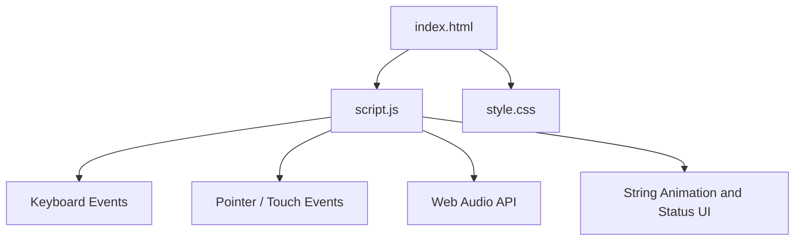

# Project Architecture — Virtual Sitar

---

## Overview

Virtual Sitar is a standalone browser mini project that lets users play seven visible sitar strings. Each string can be plucked with a mouse or touch interaction, or played from the keyboard using the A–J key mapping. The project uses native browser APIs and requires no external runtime dependencies.

---

## Purpose & Goals

- Provide a simple, playable virtual sitar experience in the browser.
- Make every visible string interactive with pointer and touch input.
- Support keyboard playback for desktop users.
- Provide immediate visual and audio feedback when a string is plucked.
- Keep the project self-contained and easy for contributors to understand.

---

## Folder Structure

```text
sitar/
├── index.html          # Page structure, controls, and accessible string container
├── script.js           # String creation, input handling, animation, and audio playback
├── style.css           # Sitar illustration, responsive layout, and interaction styling
└── ARCHITECTURE.md     # Project architecture documentation
```

---

## System / Project Architecture Overview

The project follows a simple separation of concerns: `index.html` provides the semantic page shell, `style.css` renders the sitar and responsive interface, and `script.js` creates the playable strings and handles keyboard, pointer, touch, and audio behaviour. No build step or framework is required.



---

## Component Breakdown

| File | Responsibility |
|---|---|
| `index.html` | Semantic page shell, sitar containers, keyboard hints, sound control, and status region |
| `script.js` | Defines notes, creates strings, handles keyboard/pointer input, plays sounds, and updates feedback |
| `style.css` | Sitar illustration, string visuals, controls, animations, and mobile-responsive layout |
| `ARCHITECTURE.md` | Documents the project's structure and implementation decisions |

---

## Data Flow / Execution Flow

```text
User opens index.html
↓
Browser loads style.css and script.js
↓
script.js creates seven interactive string buttons
↓
User presses A–J or interacts with a string
↓
The matching string is animated and its note/status is updated
↓
Web Audio API generates the corresponding tone when sound is enabled
```

---

## Key Features

- Seven visible interactive sitar strings.
- Keyboard playback using A, S, D, F, G, H, and J.
- Mouse and touch plucking through pointer events.
- Visual string animation and note feedback.
- Basic synthesized plucking sound using the Web Audio API.
- Sound on/off control.
- Responsive layout for desktop and mobile screens.
- Accessible button labels and live status feedback.

---

## Technologies Used

| Technology | Purpose |
|---|---|
| HTML5 | Semantic page structure and accessible controls |
| CSS3 | Sitar illustration, layout, animation, and responsive styling |
| Vanilla JavaScript (ES6+) | Input handling, DOM updates, and audio behaviour |
| Web Audio API | Client-side synthesized string sounds |

---

## File Responsibilities

### `index.html`
- Defines the page heading and usage instructions.
- Provides the sitar visual containers and controls.
- Provides a live status region for interaction feedback.
- Loads `style.css` and `script.js`.

### `script.js`
- `notes` — stores keyboard mappings, note names, and frequencies for the seven strings.
- `getAudioContext()` — lazily creates or resumes the browser audio context.
- `pluck(index)` — animates the selected string, updates status text, and generates the note.
- The `notes.forEach()` block creates accessible interactive string buttons.
- The `keydown` listener maps A–J keyboard input to strings.
- The sound button toggles audio playback.

### `style.css`
- Builds the sitar body, neck, frets, bridges, tuning area, and strings with CSS.
- Defines the active-string visual feedback.
- Provides keyboard/control styling.
- Uses a mobile media query to adapt the instrument to smaller screens.

---

## Design Decisions

- **Vanilla JavaScript:** Keeps the mini project dependency-free and easy for contributors to modify.
- **Pointer events:** A single `pointerdown` handler supports mouse, touch, and other pointer-capable devices without separate input implementations.
- **Lazy Web Audio initialization:** The audio context is created only when the user first plays a string, which respects browser autoplay restrictions.
- **Interactive buttons for strings:** Native buttons provide keyboard-focus semantics and accessible labels while still allowing pointer interaction.
- **CSS-rendered instrument:** The sitar is drawn with CSS so the mini remains standalone and does not require image assets.

---

## Dependencies

None. The project uses native HTML, CSS, JavaScript, and the Web Audio API. No external libraries or assets are required.

---

## Future Improvements

- Add more authentic sitar harmonics and resonance modelling.
- Add adjustable tuning and additional sympathetic strings.
- Add plucking-position interaction for tonal variation.

---

## Known Limitations

- The current sound is a lightweight synthesized approximation rather than a sampled sitar recording.
- The project provides seven playable strings rather than modelling every string and fret position of a physical sitar.

---

## Development Notes

- No build step is required for the mini project itself; the browser loads the three runtime files directly.
- Test the keyboard interaction with A–J and the pointer interaction on both desktop and touch-capable devices.
- The repository's architecture validation requires every mini-project directory to contain a non-empty `ARCHITECTURE.md` with the required sections.

---

## License & Attribution

- **Project License:** MIT
- **Third-Party Assets:** None.

---

## References

- [MDN Web Docs — Web Audio API](https://developer.mozilla.org/en-US/docs/Web/API/Web_Audio_API)
- [MDN Web Docs — Pointer events](https://developer.mozilla.org/en-US/docs/Web/API/Pointer_events)

