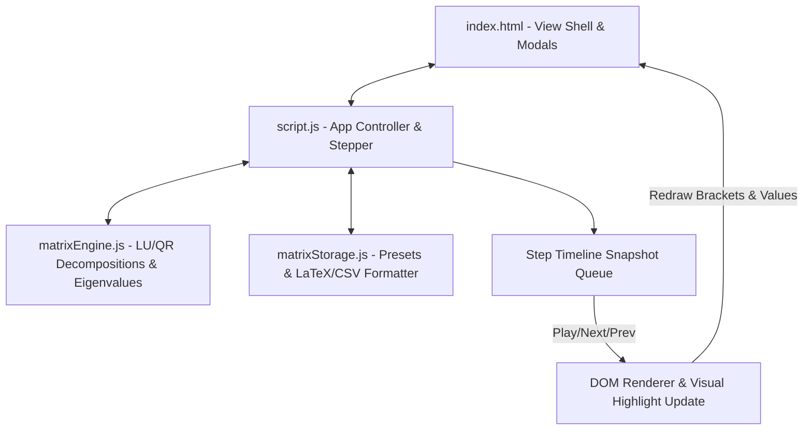

# Project Architecture — Matrix Operations & Decomposition Playground

This document details the architecture and structure of the **Matrix Operations & Decomposition Playground** project located in `projects/math/matrix-playground/`.

---

## Overview

The **Matrix Operations & Decomposition Playground** is an interactive linear algebra workbench allowing users to perform core matrix operations (Addition, Multiplication, Determinant, Inverse, Transpose) along with advanced matrix decompositions (**LU Decomposition**, **QR Decomposition**) and **Eigenvalue Spectral Analysis**.

---

## Purpose & Goals

- Demonstrate core matrix operations and decompositions with a visible step-by-step stepper
- Explain LU decomposition, QR decomposition, and eigenvalue analysis as they are computed
- Keep the math engine (`matrixEngine.js`) pure and DOM-free so it can be reused and tested in Node
- Provide presets, random fills, and LaTeX/CSV export to make the tool feel like a lab

---

## Folder Structure

```text
projects/math/matrix-playground/
├── ARCHITECTURE.md    # Architectural documentation and specifications
├── README.md          # Usage instructions, formula descriptions, and project features
├── index.html         # HTML layout, controls, grid placeholders, and export modal
├── matrixEngine.js    # Linear algebra calculations (LU, QR, Eigenvalues, Inverses)
├── matrixStorage.js   # Matrix presets catalog, LocalStorage persistence, LaTeX/CSV export
├── script.js          # DOM controller, event handlers, and step playback stepper
├── style.css          # Glassmorphic layout, matrix brackets, animation keyframes
└── thumbnail.svg      # Project thumbnail graphic
```

---

## System / Project Architecture Overview



---

## Component Breakdown

| File | Role |
| --- | --- |
| `matrixEngine.js` | Pure mathematical calculation engine for LU decomposition, QR decomposition, eigenvalues, determinants, and inverses. |
| `matrixStorage.js` | Preset catalog (Identity, Rotation, Shear, Hilbert, Magic Square), LocalStorage cache, and LaTeX/CSV formatting. |
| `script.js` | Interactive UI controller, event listener setup, animation stepper management, and DOM grid rendering. |
| `index.html` | Interface layout, operation buttons, dimension selectors, visual timeline controls, and LaTeX export modal. |
| `style.css` | Design tokens, grid layouts, responsive rules, modal overlays, and animation keyframes. |

---

## Data Flow / Execution Flow

```text
User selects Operation / Presets / Matrix Dimensions
                     ↓
`matrixEngine.js` performs matrix computations (LU, QR, Det, Inv, Eigen)
                     ↓
`script.js` builds step-by-step animation snapshots
                     ↓
`matrixStorage.js` serializes outputs for LaTeX / CSV export dialogs
                     ↓
DOM render updates result matrix grid & step progress bar
```

---

## Key Features

- Eight operations: Add, Multiply, Determinant, Inverse, Transpose, LU Decomposition, QR Decomposition, and Eigenvalues
- Editable 2x2, 3x3, and 4x4 matrix grids with live recomputation on every keystroke
- Six presets: Identity, 45° Rotation, 2D Shear, Magic Square, Symmetric, and Hilbert matrices
- Random fill, Identity fill, and Clear All actions
- Step-by-step visual stepper with play/previous/next/restart and adjustable speed
- Per-step explanation text plus a math scratchpad showing the current calculation
- LaTeX export modal with copy-to-clipboard
- Dark/light theme toggle persisted to localStorage

---

## Technologies Used

| Technology | Purpose |
|---|---|
| HTML5 | Page structure, matrix grids, LaTeX export modal |
| CSS3 (Grid, Flexbox, Custom Properties) | Layout, glassmorphic styling, responsive design |
| Vanilla JavaScript (ES6+) | UI controller, event handling, step playback |
| Cradle storage.js | localStorage persistence for saved matrices |
| Font Awesome 6.5.1 (CDN) | UI icons |
| Google Fonts (Space Grotesk, Inter, JetBrains Mono) | Typography |
| Cradle tokens.css | Shared design tokens |

---

## File Responsibilities

### `matrixEngine.js`

- `add(a, b)` / `subtract(a, b)` / `multiply(a, b)` / `scale(matrix, scalar)` / `transpose(matrix)` — basic arithmetic
- `determinant(matrix)` — LU elimination with partial pivoting for n >= 3
- `inverse(matrix)` — Gauss-Jordan elimination on an augmented matrix
- `rank(matrix)` — row-echelon-form rank
- `luDecomposition(matrix)` — Doolittle method returning `{ L, U }`
- `qrDecomposition(matrix)` — Gram-Schmidt orthogonalisation returning `{ Q, R }`
- `eigenvalues(matrix)` — 2x2/3x3 characteristic polynomial roots, including complex pairs

### `matrixStorage.js`

- `getPresets()` / `getPreset(key)` — built-in preset catalog
- `saveCustomMatrix(name, matrix)` / `getSavedMatrices()` / `deleteSavedMatrix(name)` — persistence via CradleStorage
- `toLaTeX(matrix, env)` — LaTeX matrix block formatter
- `toCSV(matrix)` / `toJSON(matrix)` / `parseMatrixString(str)` — export/import formats

### `script.js`

- `state` — selected operation, dimensions, matrices, and stepper timeline
- `init()` — theme setup, event listeners, initial grid render
- `setOperation(op)` / `updateOpUI()` — operation switching and UI updates
- `rebuildGrids()` / `renderMatrixGrid(container, rows, cols, ...)` — matrix input rendering
- `computeAndBuildTimeline()` — dispatches to per-operation timeline builders (`buildAddTimeline`, `buildMultiplyTimeline`, `buildLUTimeline`, `buildQRTimeline`, `buildEigenTimeline`, etc.)
- `prevStep()` / `nextStep()` / `startAnimation()` / `pauseAnimation()` / `resetStepper()` — stepper playback
- `openLatexModal()` / `copyLatexToClipboard()` — LaTeX export flow

### `style.css`

- Cradle design tokens with `--theme-accent` overrides
- `.matrix-bracket` left/right — brackets framing each matrix grid
- `.matrix-cell-input` / `.matrix-cell-result` — editable and result cells
- `.cell-highlight-active` + `pulseHighlight` — active-cell animation during playback
- `.modal-backdrop` / `.modal-content` — LaTeX export modal
- Responsive breakpoints at 1024px and 640px

---

## Design Decisions

- **Pure engine isolated from UI** — `matrixEngine.js` and `matrixStorage.js` expose their API through a UMD-style wrapper (window global plus `module.exports`) so they run in the browser and can be imported in Node for testing.
- **Step-timeline rendering** — `script.js` builds a timeline of snapshots (text, scratchpad, partial result, active cells) so the stepper replays computations without re-running the math.
- **Textbook algorithms** — Doolittle LU and Gram-Schmidt QR are chosen for clarity over performance, which is fine for small 2x2/3x3/4x4 matrices.
- **Eigenvalue solver handles complex roots** — the 3x3 characteristic cubic uses the Cardano/trigonometric solution so rotation-like matrices produce correct complex eigenvalue pairs.

---

## Dependencies

| Dependency | Version | How loaded | Purpose |
|---|---|---|---|
| Font Awesome | 6.5.1 | CDN (`<link>`) | UI icons |
| Space Grotesk / Inter / JetBrains Mono | — | Google Fonts CDN | Typography |
| Cradle tokens.css | — | Local stylesheet | Shared design tokens |
| Cradle storage.js | — | Local script | localStorage persistence |
| Cradle BackToHome.js | — | Local script | Home navigation button |

No build step, package manager, or npm dependency.

---

## Future Improvements

- Add an undo/history stack for matrix edits
- Support larger matrices (5x5+) with a scrollable layout
- Add Cholesky decomposition and SVD
- Plot eigenvalues/eigenvectors on a complex plane
- Save and restore named matrices from the UI

---

## Known Limitations

- Eigenvalue analysis is limited to 2x2 and 3x3 matrices
- Only eigenvalue values are shown — no eigenvector computation
- The UI grid caps at 4x4 matrices
- Decomposition steps are shown as results, not row-by-row elimination

---

## Development Notes

- Open `index.html` through a local server (e.g. `python3 -m http.server 8000`) so the shared Cradle assets (tokens.css, storage.js, BackToHome.js) load correctly
- Run engine tests in Node: `node --test tests/matrix-playground.test.js`
- The math engine is standalone: `const engine = require('./matrixEngine.js')`
- No build step is required. Edit any file and refresh the browser.

---

## License & Attribution

- **Project License:** MIT
- **Third-Party Assets:**
  - 'Space Grotesk', 'Inter', and 'JetBrains Mono' fonts by [Google Fonts](https://fonts.google.com) (OFL License)
  - Font Awesome 6.5.1 icons by [Fonticons, Inc.](https://fontawesome.com) (CC BY 4.0)

---

## References

- [Matrix multiplication — Wikipedia](https://en.wikipedia.org/wiki/Matrix_multiplication)
- [LU decomposition — Wikipedia](https://en.wikipedia.org/wiki/LU_decomposition)
- [QR decomposition — Wikipedia](https://en.wikipedia.org/wiki/QR_decomposition)
- [Eigenvalues and eigenvectors — Wikipedia](https://en.wikipedia.org/wiki/Eigenvalues_and_eigenvectors)
