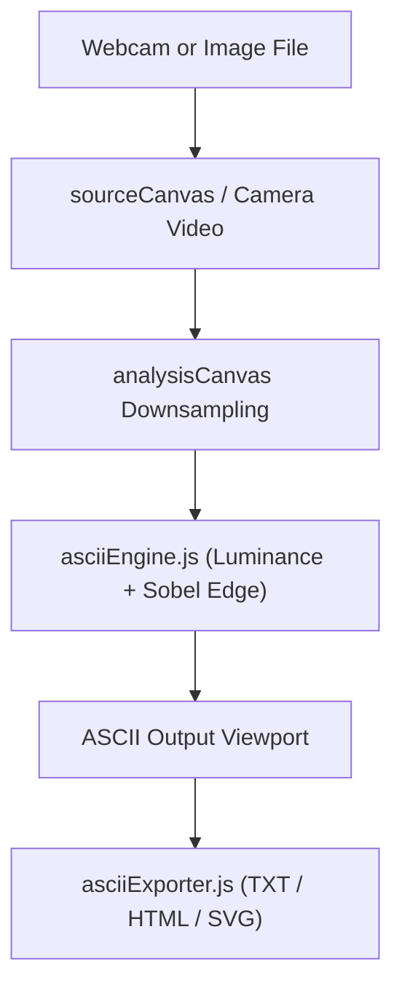

# ASCII Camera Studio Architecture

## Overview

ASCII Camera Studio is a client-side web application that transforms webcam video feeds and local image files into ASCII art with customizable character ramps, Sobel edge detection contouring, and multi-format export tools (TXT, HTML, SVG, PNG).

---

## Purpose & Goals

- Transform webcam feeds and local images into real-time ASCII art entirely in the browser
- Provide a live, tunable rendering pipeline (density, columns, contrast, brightness, inversion)
- Support Sobel edge detection as an alternative contouring style
- Export the result as plain text, styled HTML, or SVG

---

## Folder Structure

```text
projects/misc/ascii-camera/
├── ARCHITECTURE.md   # System architecture and data flow specifications
├── README.md         # Documentation, feature highlights, and controls
├── index.html        # HTML layout, controls panel, source preview, ASCII output
├── asciiEngine.js    # Core image processing, Sobel edge detection, palette mapping
├── asciiExporter.js  # Format serializers for TXT, HTML document, and SVG vector
├── script.js         # Camera stream loop, UI controller, event bindings
├── style.css         # Glassmorphic layout styling, character picker pills, responsive rules
└── thumbnail.svg     # Project thumbnail graphic
```

---

## System / Project Architecture Overview



---

## Component Breakdown

| File | Role |
| --- | --- |
| `asciiEngine.js` | Luminance calculation, character palette mapping, contrast adjustment, Sobel edge filter. |
| `asciiExporter.js` | Multi-format serialization: plain text (`.txt`), styled HTML (`.html`), and SVG vector (`.svg`). |
| `script.js` | Media stream lifecycle, frame animation loop, DOM binding, export triggers. |
| `index.html` | Page structure, video frame, canvas elements, slider controls, export action bar. |
| `style.css` | CSS tokens, responsive flex/grid layouts, dark theme palette, typography styles. |

---

## Data Flow / Execution Flow

```text

User opens index.html
        ↓
Choose a source: webcam, image upload, or sample
        ↓
Frame drawn onto the downsampled analysis canvas grid
        ↓
asciiEngine.js converts pixels → luminance → characters
        ↓
ASCII text rendered into the output viewport
        ↓
Controls (density, contrast, edges, invert) re-render on input
        ↓
Export buttons serialize the current output (TXT / HTML / SVG)

```

---

## Key Features

- Live webcam capture via `getUserMedia` with an FPS-limited render loop
- Image upload and an embedded sample logo source
- Five density palettes including block, binary, and minimal characters
- Optional Sobel edge detection plus invert, contrast, and brightness controls
- Copy-to-clipboard and multi-format downloads (TXT, HTML, SVG)
- Color ASCII toggle and live render statistics

---

## Technologies Used

| Technology | Purpose |
|---|---|
| HTML5 | Page structure and semantic markup |
| CSS3 | Layout, styling, and responsive design |
| Vanilla JavaScript (ES6+) | Capture loop, image processing, and UI binding |
| Canvas API | Downsampling source frames and pixel analysis |
| Media Capture API (`getUserMedia`) | Webcam video stream |

---

## File Responsibilities

### `asciiEngine.js`

- `renderImageDataToASCII()` — converts an RGBA frame into a 2D character grid
- `getLuminance()` / `mapLuminanceToChar()` — pixel brightness to character mapping
- `applySobelEdgeDetection()` — 3x3 gradient convolution for edge contours
- `adjustPixel()` — contrast and brightness adjustment

### `asciiExporter.js`

- `toPlainText()` / `toHTML()` / `toSVG()` — format serializers for the export actions
- `downloadFile()` — creates and triggers a Blob download

### `script.js`

- `startCamera()` / `stopCamera()` — webcam lifecycle management
- `scheduleNextFrame()` / `processCurrentFrame()` — FPS-limited render loop
- `loadUploadedImage()` / `loadSample()` — alternate input sources
- `setupEvents()` — binds all controls, toggles, and export buttons

### `index.html`

- Source preview panel (video, canvas, empty state)
- Controls panel with sliders, toggles, and export actions
- ASCII output viewport

### `style.css`

- Layout, panels, toggles, and responsive rules

---

## Design Decisions

- **Pure engine modules** — image processing and export serialization live in `asciiEngine.js` and `asciiExporter.js`, free of DOM dependencies and exposed through UMD-style globals so they can be reused and tested independently.
- **Hidden analysis canvas** — frames are downsampled to a low-resolution grid on an off-screen canvas so character mapping stays fast enough for real-time webcam use.
- **Read-optimized canvas contexts** — `willReadFrequently: true` avoids GPU readback stalls during per-frame pixel access.
- **No external libraries** — rendering is implemented from scratch to keep the mini-project self-contained.

---

## Dependencies

None. The project uses only native browser APIs — no external JavaScript libraries are required. Google Fonts (Inter and JetBrains Mono) are loaded for UI typography.

---

## Future Improvements

- Wire up the Export PNG button, which is rendered in the UI but has no handler in `script.js`
- Support saving and reusing custom palettes
- Add batch processing of multiple images
- Provide animated GIF or video export from the live feed

---

## Known Limitations

- The Export PNG button is present in the UI but is not connected to an export handler yet
- Performance depends on column count and device — very high resolutions slow the live loop
- Camera mode requires a granted `getUserMedia` permission and does not work over the `file://` protocol
- Sample mode skips the processing pipeline and shows static art only

---

## Development Notes

- Serve the folder through a local server (e.g. `python3 -m http.server 8000`); the `file://` protocol blocks `getUserMedia` and some APIs.
- No build step is required — edit the files and refresh the browser.
- `asciiEngine.js` and `asciiExporter.js` can be imported in Node for headless testing.

---

## License & Attribution

- **Project License:** MIT
- **Third-Party Assets:**
  - Inter and JetBrains Mono (fonts) — Google Fonts CDN — UI typography

---

## References

- [MDN Web Docs — MediaDevices.getUserMedia](https://developer.mozilla.org/en-US/docs/Web/API/MediaDevices/getUserMedia)
- [MDN Web Docs — Canvas API](https://developer.mozilla.org/en-US/docs/Web/API/Canvas_API)
- [Sobel operator — Wikipedia](https://en.wikipedia.org/wiki/Sobel_operator)
