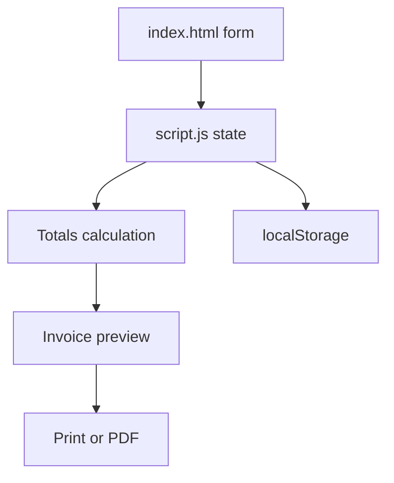

# Invoice Generator Architecture

## Overview

Invoice Generator is a static browser mini project for creating professional invoices from editable billing data. It supports business and client details, logo upload, dynamic line items, automatic totals, templates, JSON import/export, local autosave, and browser print/PDF export.

The project runs entirely in the browser. It does not require a backend, build step, or new package dependency.

---

## Purpose & Goals

- Let users create invoices quickly from a browser page.
- Calculate subtotal, discount, taxable amount, tax, shipping, and final total in real time.
- Keep invoices portable with JSON export and import.
- Support business branding through logo upload and invoice templates.
- Use browser print support for PDF export without adding PDF libraries.
- Match the existing Cradle mini-project structure and shared UI conventions.

---

## Folder Structure

```text
invoice-generator/
├── ARCHITECTURE.md  # Project architecture and contributor notes
├── README.md        # User-facing usage, testing, and export instructions
├── index.html       # Entry point, invoice form, toolbar, preview shell, and item row template
├── invoiceEngine.js # Calculation engine, currency formatter, and serializer
├── script.js        # Invoice state, UI binding, rendering, and event handlers
├── style.css        # App layout, invoice templates, responsive behavior, and print styles
└── thumbnail.svg    # Generated project thumbnail used by the Cradle project gallery
```

- **tests/invoice-generator.test.js**: Unit test suite covering currency formatting, totals computation, and JSON serialization.

---

## System / Project Architecture Overview

The project follows a simple static frontend architecture. `index.html` provides the editor controls and invoice preview container, `script.js` keeps the invoice state synchronized with the DOM, and `style.css` separates the dark editor interface from the printable white invoice layout.



---

## Component Breakdown

| File | Responsibility |
| --- | --- |
| `index.html` | Defines invoice controls, form fields, line item template, preview panel, and shared Cradle script links. |
| `script.js` | Handles initialization, state collection, total calculations, preview rendering, logo upload, autosave, print, and JSON import/export. |
| `style.css` | Styles the editor, invoice preview, template variants, responsive layouts, and print-only invoice view. |
| `README.md` | Documents user-facing features, run steps, manual testing, and export behavior. |
| `thumbnail.svg` | Generated by `npm run build` through `scripts/generate-projects.js`. |

---

## Data Flow / Execution Flow

```text
User opens index.html
        |
Browser loads tokens.css, style.css, Button.js, BackToHome.js, and script.js
        |
DOMContentLoaded runs initializeInvoiceGenerator()
        |
Saved invoice from localStorage loads, otherwise sampleInvoice loads
        |
User edits form fields, line items, logo, template, or currency
        |
collectInvoice() builds the current invoice object
        |
calculateTotals() computes subtotal, discount, tax, shipping, and total
        |
renderPreview() updates the printable invoice
        |
persistInvoice() saves the latest invoice to localStorage
        |
User prints/PDF exports, exports JSON, or imports JSON
```

---

## Data Persistence

The application stores invoice drafts entirely in the browser using the `localStorage` API.

- Every invoice change automatically updates the saved draft.
- When the application loads, it restores the previously saved invoice if one exists.
- If no saved invoice is found, the bundled `sampleInvoice` is loaded instead.
- No invoice data is transmitted to any external server.

---

## Import / Export Format

Invoice data is serialized as JSON for portability.

The exported file contains:

- Business information
- Client information
- Invoice metadata
- Line items
- Discount, tax, and shipping values
- Selected invoice template
- Selected currency
- Payment terms
- Notes
- Uploaded logo as a Data URL

Importing a previously exported JSON file restores the complete invoice state.

---

## Key Features

- Editable business and client billing details.
- Logo upload with immediate invoice preview.
- Dynamic line item creation and removal.
- Real-time subtotal, discount, tax, shipping, and total calculation.
- Currency selection for USD, INR, EUR, and GBP.
- Classic, Modern, and Compact invoice templates.
- Browser print dialog support for PDF export.
- JSON export and import for reusable invoice data.
- Autosave with `localStorage`.
- Print CSS that hides editor controls and prints the invoice only.

---

## Technologies Used

| Technology | Purpose |
| --- | --- |
| HTML5 | Semantic page structure, form controls, toolbar, preview shell, and reusable item row template. |
| CSS3 | Responsive editor layout, invoice paper styling, template variants, and print media rules. |
| Vanilla JavaScript | State collection, calculations, DOM rendering, event handling, and exports. |
| localStorage API | Persists the current invoice between browser sessions. |
| FileReader API | Reads uploaded logos and imported JSON invoice files. |
| Blob URL API | Creates downloadable JSON export files. |
| Intl.NumberFormat | Formats currency totals for the selected currency. |
| Browser Print API | Opens the print dialog used for save-as-PDF export. |
| Cradle UI components | Applies shared button styling and back-to-home behavior. |

---

## File Responsibilities

### `index.html`

- Loads Google Fonts, Cradle design tokens, local styles, and local JavaScript.
- Defines the header, template selector, currency selector, import/export controls, and PDF export button.
- Defines the invoice form fields for business, client, dates, logo, totals, payment terms, and notes.
- Provides the `itemRowTemplate` used when creating line item rows.
- Provides `invoicePreview`, where `script.js` renders the printable invoice.

### `script.js`

- `sampleInvoice` provides useful default invoice data for first load and testing.
- `initializeInvoiceGenerator()` loads saved/sample data and attaches event listeners.
- `loadInvoice(invoice)` populates form controls and line items from an invoice object.
- `addItem(item)` creates editable line item rows from the HTML template.
- `collectInvoice()` converts the current form and line items into a serializable object.
- `calculateTotals(invoice)` returns subtotal, discount, taxable amount, tax, shipping, and final total.
- `renderItemTotals(invoice)` updates each editor row amount.
- `renderPreview(invoice, totals)` builds the printable invoice markup.
- `handleLogoUpload(event)` stores uploaded logo image data for preview and JSON export.
- `exportInvoiceJson()` and `importInvoiceJson(event)` handle invoice data portability.
- `persistInvoice(invoice)` and `readSavedInvoice()` handle browser autosave.
- `printInvoice()` opens the browser print dialog.

### `style.css`

- Defines local invoice color variables while reusing Cradle tokens.
- Styles the dark editor shell, toolbar, form fields, line item rows, and status message.
- Styles printable invoice paper separately from the editor UI.
- Provides `template-classic`, `template-modern`, and `template-compact` visual variants.
- Uses responsive grid changes for smaller screens.
- Uses `@media print` to hide controls and print only the invoice preview.

---

## Design Decisions

- **Browser print for PDF export** - avoids adding heavy PDF dependencies and works with the browser's built-in save-as-PDF flow.
- **localStorage autosave** - preserves drafts without needing accounts, databases, or server storage.
- **JSON import/export** - keeps invoice data portable and easy to review.
- **Data URL logo storage** - lets uploaded logos appear immediately and travel with exported JSON.
- **Template class switching** - keeps template changes in CSS instead of duplicating invoice markup.
- **Discount cap** - prevents discounts from reducing taxable amount below zero.

---

## Dependencies

| Dependency | Version | How loaded | Purpose |
| --- | --- | --- | --- |
| Inter and JetBrains Mono | — | Google Fonts CDN (`<link>` tags) | UI and monospace typography |

This project otherwise uses native browser APIs and existing Cradle UI files (`tokens.css`, `Button.js`, `BackToHome.js`, `escapeHtml.js`) only.

---

## Future Improvements

- Add tax label customization for GST, VAT, or Sales Tax.
- Add invoice status fields such as Draft, Sent, Paid, and Overdue.
- Add payment method fields for UPI, bank transfer, or online payment links.
- Add standalone HTML invoice export.
- Add more invoice templates and accent color options.

---

## Known Limitations

- PDF export depends on the browser print dialog and the user's print settings.
- Logo images are stored as data URLs, so very large logo files can increase saved JSON size.
- The project does not integrate with payment gateways or accounting systems.
- Autosaved invoices are stored only in the current browser profile.

---

## Development Notes

- Open `index.html` directly in a browser, or use a local server from the repository root.

```bash
python -m http.server 8000
```

Then visit:

```text
http://localhost:8000/projects/productivity/invoice-generator/
```

Manual testing checklist:

- Load the page and confirm the sample invoice appears.
- Edit business/client fields and confirm the preview updates.
- Add and remove line items and confirm totals update.
- Change currency and template and confirm preview changes.
- Upload a small logo image and confirm it appears in preview.
- Export JSON, import it again, and confirm values restore.
- Click `Export PDF`, choose save-as-PDF in the browser print dialog, and confirm only the invoice prints.

---

## License & Attribution

- **Project License:** MIT
- **Third-Party Assets:**
  - Inter font by Rasmus Andersson (https://fonts.google.com/specimen/Inter), loaded from the Google Fonts CDN.
  - JetBrains Mono font by JetBrains (https://fonts.google.com/specimen/JetBrains+Mono), loaded from the Google Fonts CDN.

---

## References

- [MDN Web Docs - Window.print](https://developer.mozilla.org/en-US/docs/Web/API/Window/print)
- [MDN Web Docs - FileReader](https://developer.mozilla.org/en-US/docs/Web/API/FileReader)
- [MDN Web Docs - Intl.NumberFormat](https://developer.mozilla.org/en-US/docs/Web/JavaScript/Reference/Global_Objects/Intl/NumberFormat)
